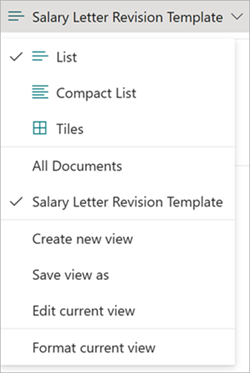

# Map fields of a modern template to library columns in Microsoft Syntex

You can map fields in a modern template to document library columns, and then add the fields to a custom view of the library. Once configured, every time a document is created from this template, the field values will get automatically extracted and filled in against the library columns and be part of the document metadata.

You no longer have to train and build AI models to extract the information already configured as fields while creating modern templates. All the relevant metadata for your generated documents will be available as columns in your document library.

## Map fields to a custom view of your library

1. When you select **Publish** to publish a modern template after creating the necessary fields, you can choose to add some or all of the created fields into a custom view of the library.

   

2. You can choose fields that you want to map in the custom view that will get created for your modern template. You can also rename the template by entering value in the **Template name** text box.

   Once done, select **Publish** to publish the modern template. If you've selected the **Set the default view of the library** option (selected by default), the library default view will be set to the template name view.

   

   If **Set the default view of the library** isn't selected, the library view will be created but won't be set as default. You can switch to the view from the **Views** menu in the library.

   

 ## Generate documents from your template
 
After choosing the specific fields to be translated as library columns when you've published the template, you can now choose to generate documents from the template.

After you generate the document, the values against the mapped fields will automatically start showing up in the library view.

   

   > [!NOTE]
   > - You can only choose to map fields when you publish a new template or republish an existing template. 
   > - You can unselect or reselect fields to be mapped as library columns every time you republish a modern template. 
   > - If you change the name of a mapped field and republish the template with the new settings, the new name changes are reflected in the corresponding library column. 
   > - If you change the data type of a mapped field and republish the template with the new settings, the new changes are reflected in the corresponding library column. If you choose to proceed with [incompatible data type change such as **Single line of text** to **Number**, or **Number** to **Date and time**](https://support.microsoft.com/office/0d8ddb7b-7dc7-414d-a283-ee9dca891df7), the mapped field will be deslected by default to prevent potential loss of data from the column. If you still choose to reselect the field to be mapped to column, you might lose data from the column values of previously created documents. The content of the documents that are already been generated won't be affected. 
   > - Mapping image and table fields to library columns is not supported. 
 
## See also

[Create conditional sections for templates](content-assembly-conditional-sections.md)
[Create a document from a modern template](content-assembly-create-document.md)