# Create a modern template in Microsoft Syntex

## Upload a document to create a modern template

Follow these steps to create a modern template.

1. From a SharePoint document library, select **New** > **Create modern template**.

   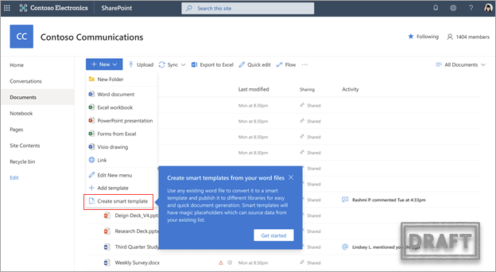

2. Select a Word document to upload from your organization’s SharePoint or OneDrive, or from your local storage.

   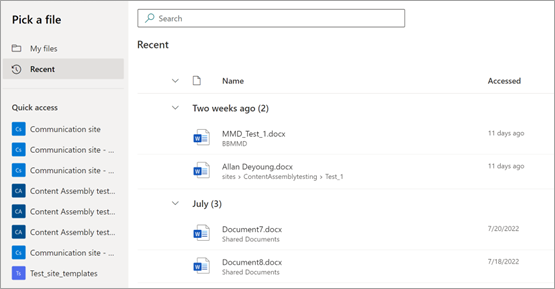

3. After you upload the document, the document is displayed in the template studio where you can convert the document to a template by adding fields.

   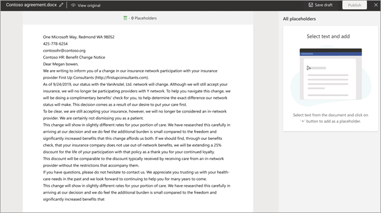

4. At the upper-left corner of the template studio, select the name for the template. The default name is the name of the document used to create the template. If you want to rename the template, select the default name or the pencil icon next to the name, type the new name, and then select **Enter**.

   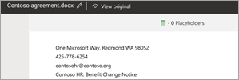

## Create and reuse fields

When you select a document to create a modern template, you can create a new field and map it to multiple occurrences of the content with the same field.

For example, the name of a contractor can occur multiple times in a consulting agreement document. You can create a field named “Contractor Name” and associate it with all occurrences of the name throughout the document when you generate a modern template.

   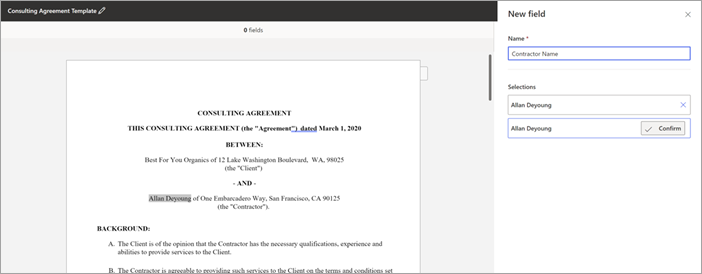

To create and reuse a field:

1. Select a section of the content, and when it appears on the field panel on the right, select **Confirm**. You can select as many occurrences as required.

2. When the field is created, select **Next** to associate the created field with different data sources.

3. When done, you can see the count of all selections in the field card with the field name and the associated data source.

   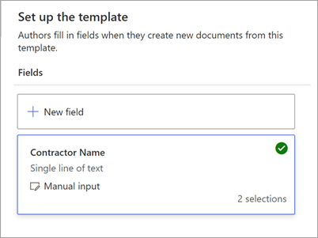

## Associate fields with different data sources

You can associate fields by:

- [Entering text or selecting a date](#associate-a-field-by-entering-text-or-selecting-a-date)

- [Selecting from choices in a column of a list or library](#associate-a-field-by-selecting-from-choices-in-a-column-of-a-list-or-library)

- [Selecting from a managed metadata term set or term](#associate-a-field-by-selecting-from-a-managed-metadata-term-set-or-term)

- [Associating a table with a SharePoint list or library](#associate-a-table-with-a-sharepoint-list-or-library)

- [Adding an image field](#add-an-image-field)

### Associate a field by entering text or selecting a date

On the **New field** panel:

1. In the **Name** field, enter a relevant name for the field.

2. In the **How authors fill in this field** section, select **Enter text or select a date**.

   

3. In the **Type of info** field, select the data type you want to associate with the field. Currently, there are six options available: **Single line of text**, **Multiple lines of text**, **Number**, **Date and time**, **Email**, and **Hyperlink**.

4. Select **Add**.

   > [!NOTE]
   > You can configure multiple date formatters such as MM/DD/YYYY, DD/MM/YYYY, YYYY/MM/DD, and Month DD, including setting time in both 12-hour and 24-hour format. 

### Associate a field by selecting from choices in a column of a list or library

On the **New field** panel:

1. In the **Name** field, enter a relevant name for the field.

2. In the **How authors fill in this field** section, choose **Select from choices in a column of a list or library**, and then choose **Select**.

   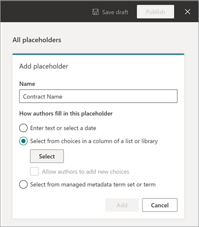

3. On the **Select a list for adding a source column** page, select the list you want to use, and then select **Next**.

   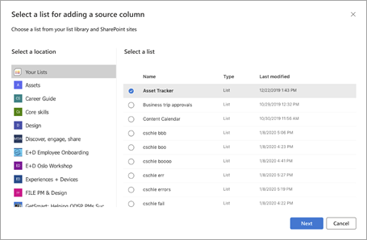

4. On the **Select a source column from the existing list** page, select the column name you want to associate with the field, and then select **Save**.

   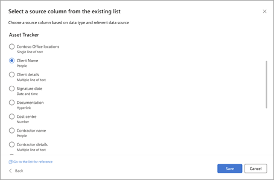

    If you want to see the original page of lists again, select **Go to (list name)** link at the bottom of the list.

5. When you're done, you'll see that the list field has been associated with the field.

   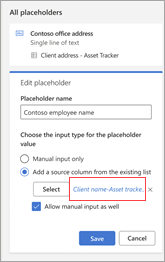

6. If you want users to be able to add inputs manually, in addition to choosing from a list, select **Allow authors to add new choices**. In this case, the default for the manual input data type is *Single line of text*. Also the values input by the authors will only be used to generate the document. They won't be added to the SharePoint list.

### Associate a field by selecting from a managed metadata term set or term

On the **New field** panel:

1. In the **Name** field, enter a relevant name for the field.

2. In the **How authors fill in this field** section, choose **Select from managed metadata term set or term**, and then choose **Select**.

   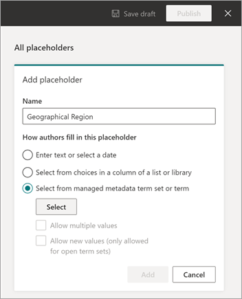

3. On the **Select term sets or terms** page, search for or select the term set or term to associate with the field, and then select **Save**.

   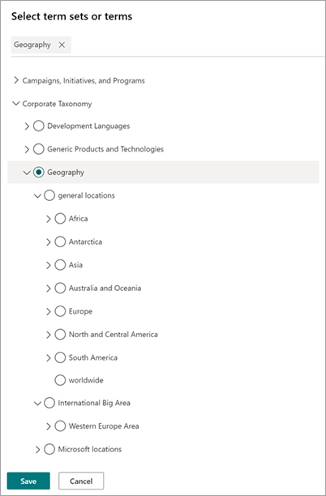

4. When you’re done, you’ll see that the selected term set or term has been associated with the field. 

   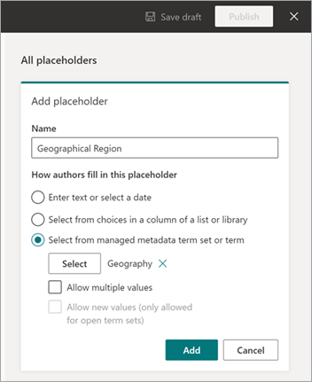

5. If you want users to be able to add multiple values corresponding to the term set or term, select **Allow multiple values**. Also, if the term set is configured as an open term set, you can select **Allow new values**. If you enable this option, users who generate documents from the modern template can add new terms to the term set and add those terms as field values.

   > [!TIP]
   > When you enable the **Allow new values** option (only allowed for open term sets), users are more likely to add redundant terms in the term store. Redundant terms can make it difficult for admins to manage a term set.

### Associate a table with a SharePoint list or library

On the **New field** panel:

1.	In the **Name** field, enter a relevant name for the field.

    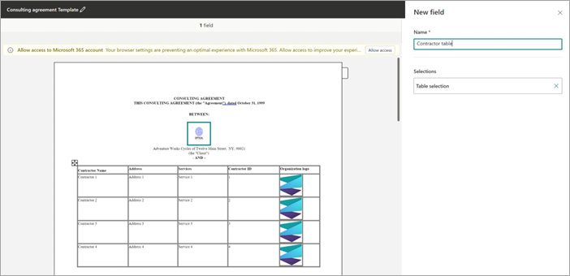

2.	Select the table section in the document you want to create a field for. You can view the table selection in the **Fields** section. 

3.	Confirm the selection, and then select **Next**.

4.	On the **Select a list for adding a source column** page, associate a SharePoint list or library to the table.

    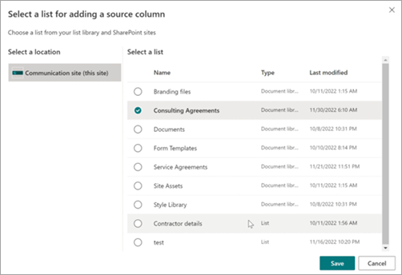

5.	Once the list is selected, map the list columns to the table columns.

    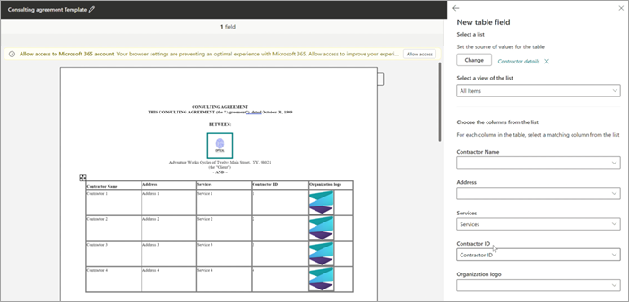

    The associated list column names that match with the table header columns will be filled in automatically, which you can then modify.

6.	Next, map all the table columns to the list columns.

    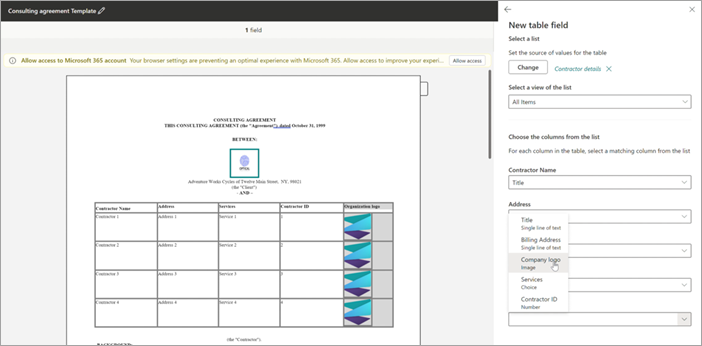

7.	When all the table columns are mapped, you can see the table selection in the **Fields** section.

    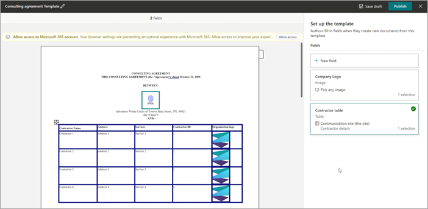

When users generate documents from the template, they can select relevant list entries to be filled in, and the table rows will increase or decrease based on the number of row selections made.

### Add an image field

On the **New field** panel:

1.	In the **Name** field, enter a relevant name for the field.

    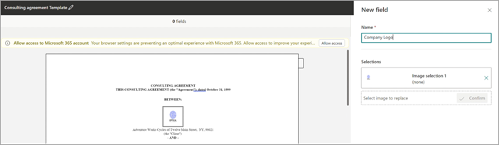

2.	Select the image section in the document you want to create a field for. You can view the image name and the alt text (a description of the image) for the selected image in the **Fields** section.

3.	Confirm the selection, and then select **Next**.

4.	You can choose to allow authors who will fill in the field to either upload images from any source—OneDrive or SharePoint or from local storage—or restrict the entries by associating it to an image column in a SharePoint list.

5.	You can choose to control how the image selected by the author will be filled in the document. If you select the **Resize** checkbox, then the uploaded image will be scaled to the dimensions of the image selected for templatization. If not selected, then the image dimension of the image uploaded by the author will be persisted.

    > [!TIP]
    > When you enable the **Resize** option, users are more likely to have favorable results of the image dimensions in the template. 

## Save a modern template as a draft

You can create as many fields as you think are necessary. When you're done, you can choose to save the template as a draft.

1. Select **Save draft** to save the template as a draft and you can access it later.

2. To view, edit, or publish saved drafts from the **Draft templates** dropdown menu in the **Modern templates**, select **New** > **Edit New menu** from the document library.

## Publish a modern template

When you have completed adding all relevant fields to the template and you want to make it available for use by other users in the document library, you can publish the template.

1. Select **Publish** to publish the template to be used by other users in the organization to create documents.

2. To view, edit, or unpublish *published* templates from the **Published templates** dropdown menu in the **Modern templates** section, select **New** > **Edit New menu** from the document library. 

## See also

[Map fields of a modern template to library columns](content-assembly-map-fields.md)

[Edit a modern template](content-assembly-edit-template.md)

[Create a document from a modern template](content-assembly-create-document.md)
