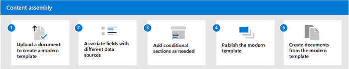

# Overview of content assembly in Microsoft Syntex

You can use the content assembly capabilities in Microsoft Syntex to help you automatically generate standard repetitive business documents, such as contracts, statements of work, service agreements, letters of consent, sales pitches, and correspondence. You can do all these actions quicker, more consistently, and with fewer errors by creating modern templates and using those templates to generate documents.

You upload an existing document to create a modern template, and then use that template to automatically generate new content using SharePoint lists or manual entries as a data source.

> [!NOTE]
> You must be a licensed Syntex user to access and use content assembly capabilities. You also must have permissions to manage SharePoint lists.

## Requirements and limitations

### Supported file types

Only Microsoft Word documents (.docx/.doc extension) are currently supported for creating a template.

### File limitations

- The Word document you want to use as a modern template shouldn't include comments or have Track Changes enabled.

- Because content controls are used in Word to create fields for the modern template, make sure any text fields for images aren't text-wrapped. If the document already contains content controls, remove them before you use it to create a modern template.

### Current release limitations

- The template and the document are associated with one document library. To use the template in another document library, you'll need to create the template again in that document library.

- The uploaded document that is used to create the modern template will be saved as a separate copy and placed in the /forms directory of the document library. The original file on the disk will be unaffected.

- You can create fields for text, and also fields for text within cells in a table. However, smart art and bulleted lists are currently not supported.

- Once a document is created from a template, it's not associated with the template.

## Differences between modern templates and other document templates

|Feature  |Modern templates  |Other templates  |
|---------|---------|---------|
|Licensing		|Syntex license needed to access this offering.  |Offered as a part of Microsoft E3 or E5 license.  |
|When to use each		     | You should use for generating standard transactional documents such as service agreements and statements of work when only specific parts of the document changes. Documents generated from modern templates ensure consistency and fewer chances of manual error and typos that occur when users change sections of the document in free flow.  |You should use this method when you want to set a document as a sample for other users to refer. You can consider using regular templates for non-transactional documents such as sales pitches or executive summaries.  |
|Standardizing content generation |You can add fields and then associate with various data sources for only specific sections of the content to make it easy for users to generate documents once template is published.  |Once uploaded, the file is kept as-is in the template. Any user using the template have to change the content accordingly.   |
|Data sources supported		|You can associate fields with SharePoint lists and term store while creating templates.   |Not applicable   |
|Document types supported	 |Only Microsoft Word documents (.docx/.doc extension) are currently supported for creating a template.  |You can use any file to upload as template.   |
|Management of templates	|Once template is created, you can edit or manage the template fields, rename the template, and republish for use.  |Not applicable   |
|Draft version of templates	|You can create draft versions of templates before finally publishing it for use by other users.   |There's no capability to create drafts of regular templates.  |
|Workflows   |You can automate document generation from templates by [setting up Power Automate workflows](automate-document-generation.md).  |Workflows can't be configured with regular templates.  |

> [!div class="nextstepaction"]
> [Get started > Create a modern template](content-assembly-modern-template.md)

 
