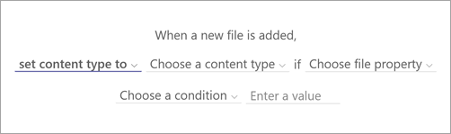
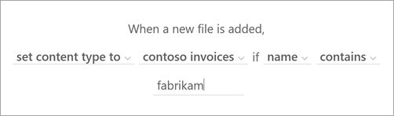

# Create a rule to set a content type when a file is added to a document library

In Microsoft Syntex, you can create a rule to automatically set the content type for a file when it's added to a document library.

## Set a content type

To set a content type when a file is added to a document library, follow these steps.

1. In the document library, select **Automate** > **Rules** > **Create a rule**.

   

2. On the **Create a rule** page, select a condition that triggers the rule and the action that the rule will take. In this case, select **A new file is added**.

   

    Your selection here creates a rule statement that you'll complete in the next step.

3. To complete the rule statement, under **When a new file is added**:

    1. Select **Choose action**, and then select **set content type to**.

       

    2. Select **Choose a content type**, and then select the appropriate [content type](/sharepoint/governance/content-type-and-workflow-planning#content-type-overview) for the file. The content types shown in this list are the ones available in the library.

       

    3. Select **Choose file property**, and then select the appropriate property for the file.

    4. Select **Choose a condition**, and then select the appropriate condition.

    5. In the **Enter a value** field, enter the appropriate value. The value can be a specific keyword or text string you want to find in the file property.

       

4. When your rule statement is complete, select **Create**. You can [see and manage the new rule](content-processing-overview.md#manage-a-rule) on the **Manage rules** page.
