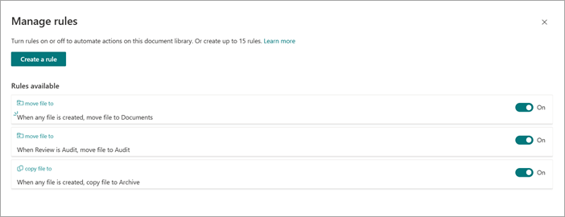
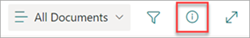

# Create a rule to set a content type when a file is added to a document library in Microsoft Syntex

Document libraries can have multiple move and copy rules to support moving and copying files to different destination libraries based on metadata criteria. 

## Set a content type

To set a content type when a file is added to a document library, follow these steps.

1. In the document library, select **Automate** > **Rules** > **Create a rule**.

   

2. On the **Create a rule** page, select a condition that triggers the rule and the action that the rule will take. In this case, select **A new file is added**.

   

    Your selection here creates a rule statement that you'll complete in the next step.

3. To complete the rule statement, under **When a new file is added**:

    1. Select **Choose action**, and then, select **set content to to**.

       

    2. Select **Content Type**, and then select the appropriate content type for the file.

    3. Select **Choose file property**, and then select the appropriate property for the file.

    4. Select **Choose a condition**, and then select the appropriate condition.

    5. In the **Enter a value** field, enter the appropriate value.

       

4. When your rule statement is complete, select **Create**. You'll see and manage the new rule on the **Manage rules** page.

## Manage a rule

1. In the document library, select **Automate** > **Rules** > **Manage rules**.

   

2. On the **Manage rules** page, you can see the rules that have been applied. You can turn on or off a rule or [create a new rule](#create-a-rule-to-move-or-copy-a-file-from-one-document-library-to-another-in-microsoft-syntex) to automate actions on a specific document library.

   

## View the activity feed of a document library

When a file is moved or copied, you'll see an update in the source library activity feed. The updates occur in both the source library and the target library.

In the document library, in the upper-right corner of the page, select the details pane icon () to view the recent history, activity, and rules that have been applied to the library.

   

> [!NOTE]
> Currently, the activity feed shows only move activity. Copy activity will be available in a future release.

