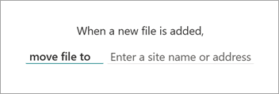
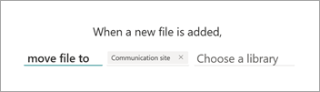
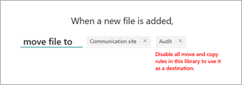

# Create a rule to move or copy a file from one document library to another

Document libraries can have multiple move and copy rules to support moving and copying files to different destination libraries based on metadata criteria. 

## Move or copy a file

To move or copy a file from one document library to another, follow these steps.

1. In the document library, select **Automate** > **Rules** > **Create a rule**.

   

2. On the **Create a rule** page, select a condition that triggers the rule and the action that the rule will take. In this case, select **A new file is added**.

   

    Your selection here creates a rule statement that you'll complete in the next step.

3. To complete the rule statement, under **When a new file is added**:

    1. Select **Choose action**, and then:

        - To copy a file, select **copy file to**.
        - To move a file, select **move file to**.

       

    2. Select **Enter a site name or address**, and then select the site that contains the document library you want the file moved or copied to.

       

          When you select **Enter a site name or address**, you can either select from the list of recent sites or enter the name or URL of another site.

    3. Select **Choose a library**, and then select the document library you want the file moved or copied to.

       

          When you select **Choose a library**, you can either select from the list of suggested libraries or enter the name of another library.

       > [!NOTE]
       > If you try to set up a rule to move or copy a file to a library that already has a move or copy rule applied, you'll receive a message saying that you need to disable all move or copy rules on the destination library. To disable a rule, see [Manage a rule](content-processing-overview.md#manage-a-rule).       
       >

    4. When your rule statement is complete, select **Create**. You can [see and manage the new rule](content-processing-overview.md#manage-a-rule) on the **Manage rules** page.

## View the activity feed of a document library

When a file is moved or copied, you'll see an update in the source library activity feed. The updates occur in both the source library and the target library.

In the document library, in the upper-right corner of the page, select the details pane icon () to view the recent history, activity, and rules that have been applied to the library.

   

> [!NOTE]
> Currently, the activity feed shows only move activity. Copy activity will be available in a future release.

