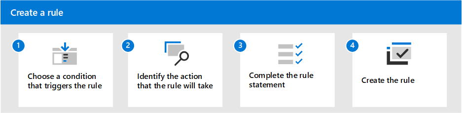
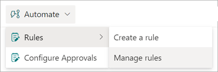
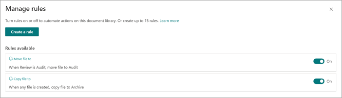

# Overview of content processing rules in Microsoft Syntex

Microsoft Syntex lets you build simple rules-driven actions in document libraries based on metadata. From a document library, you can create rules to automate tasks such as sending a notification when metadata changes in a file, when a new file is created in the library, or when files are moved or copied based on metadata extracted by Syntex models. 

   

You'll choose a condition that triggers the rule and the action that the rule will take. 
For example, you can create a rule to move files tagged with a specific customer to a specific library or folder. These rules help you structure your content architecture with the power of AI-driven processing.

> [!NOTE]
> This feature is available for users who have Syntex [per-user](set-up-content-understanding.md) or [pay-as-you-go](syntex-azure-billing.md) licensing.

## Syntex processing rules

- [Create a rule to move or copy a file from one document library to another](content-processing-create-rules.md)

- [Create a rule to set a content type when a file is added to a document library](content-processing-content-type.md)

- [Create a rule to automatically translate a file in a document library](content-processing-translate.md)

## Manage a rule

1. In the document library, select **Automate** > **Rules** > **Manage rules**.

   

2. On the **Manage rules** page, you can see the rules that have been applied. You can turn on or off a rule or create a new rule to automate actions on a specific document library.

   
