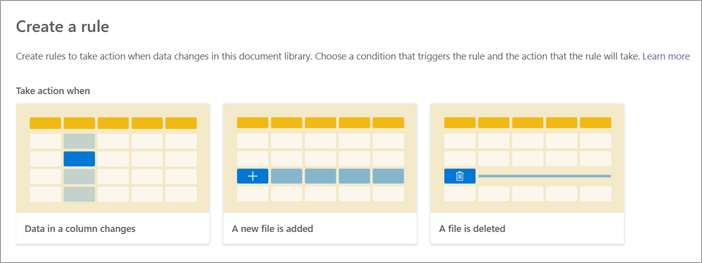
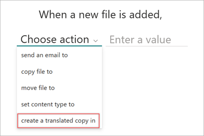

# Create a rule to automatically translate a file in a document library

You can create a rule to automatically translate a document [when a new file is added](#translate-a-document-when-a-new-file-is-added) or [when data in a column changes](#translate-a-document-when-data-in-a-column-changes) in a SharePoint document library with Microsoft Syntex.

## Translate a document when a new file is added

To create a rule to translate documents automatically when a document is created, follow these steps:

1. From a SharePoint document library, select **Automate** > **Rules** > **Create a rule**.

   

2. On the **Create a rule** page, select **A new file is added**.

   

3. Under **When a new file is added**, complete the rule statement:

    a. Select **Choose action**, and then select **create a translated copy in**.

      

    b. Select **enter a language**, and then enter a language or use the drop-down menu to choose a language into which you want to translate the file.

      

4. When your rule statement is complete, select **Create**. You can [see and manage the new rule](content-processing-overview.md#manage-a-rule) on the **Manage rules** page.

## Translate a document when data in a column changes

To create a rule to translate documents automatically when data in a column changes, follow these steps:

1. From a SharePoint document library, select **Automate** > **Rules** > **Create a rule**.

   

2. On the **Create a rule** page, select **Data in a column changes**.

   

3. Under **When data in a column changes**, complete the rule statement:

    a. Select **Choose a column**, and then select the appropriate column for which to translate the file.

     

    b. Select **Choose a condition**, and then select the appropriate condition under which to translate the file.

    c. Select **Choose action**, and then select **create a translated copy in**.

    d. Select **enter a language**, and then select the language into which you want to translate the file.

     

4. When your rule statement is complete, select **Create**. You can [see and manage the new rule](content-processing-overview.md#manage-a-rule) on the **Manage rules** page.

