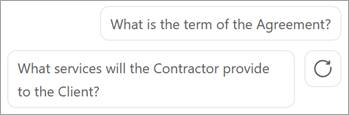

# Overview of Syntex File Q&A for Copilot (Preview)

> [!NOTE]
> This feature is currently in limited preview and subject to change.

Microsoft Syntex now brings the power of assistive AI into your organization's intelligent document processing.

Syntex File Q&A for Copilot analyzes the text of a selected file in a SharePoint document library, in OneDrive for Business, or in Teams. It then generates a set of questions you can ask about the information in the file. The questions can be used to quickly identify the type of document, generate a summary of information in the document, and identify key points or other important information. You can also ask your own questions, such as "When does this contract expire?" or "What is the fee schedule for this project?"

## To use Syntex File Q&A for Copilot

1. From a SharePoint document library, select a document.

2. On the ribbon, select **Copilot**.

    

3. The first time you use Syntex File Q&A for Copilot, you'll see this **Copilot** panel.

    

4. After that, you'll see this **Copilot** panel.

    

5. On the **Copilot** panel, you can:

    - Select one of the questions Copilot has generated for you tailored for the specific file. Or select **Refresh** () to generate more questions.

       

    - In the text box, enter your own specific question or make a request.

       

<!---    - In the text box, select **More from Syntex** to find more information about the file.

       --->

> [!NOTE]
> If you want to clear the current session, at the top of the **Copilot** panel, select **More options** (**...**), and then select **Clear session**.

## Current limitations

- Syntex File Q&A for Copilot currently works on Word (.docx), PowerPoint (.pptx), and text-readable .pdf file types. More file types will be added in the future.

- Syntex File Q&A for Copilot is currently only available to customers in the United States, and currently only understands instructions in English. More languages and locales will be added in the future.

- Syntex File Q&A for Copilot works on a single selected file at a time, and it only processes the first 4,000 tokens (approximately six pages).

- Syntex File Q&A for Copilot won't process encrypted files or files stamped with "Confidential" or "Highly Confidential" sensitivity labels.

- Syntex File Q&A for Copilot doesn't save the context of your session, but you can copy the information if you want to save it.

> [!IMPORTANT]
> It's important that you review any content the AI generates for you to make sure it has accurately produced what you wanted.

## Data security and privacy

The new Copilot experiences don't change Microsoft's commitment and principles for data security and privacy. Learn more about [Microsoft's standards for data security and privacy](https://techcommunity.microsoft.com/t5/microsoft-365-blog/administration-of-microsoft-365-in-the-new-era-of-ai/ba-p/3767079) and [how data is maintained in the Azure OpenAI service](/legal/cognitive-services/openai/data-privacy#how-is-data-retained-and-what-customer-controls-are-available).

## Let us know what you think

If you have a suggestion for Syntex File Q&A for Copilot, or if there's something you like or something you don't like about it, you can submit feedback to Microsoft from the **Copilot** panel. Select **More options** (**...**), and then select **Send feedback**.

  

This feedback is used to help us improve your experience in Syntex File Q&A for Copilot.
