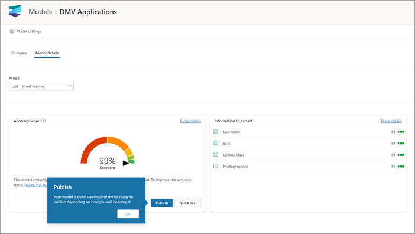
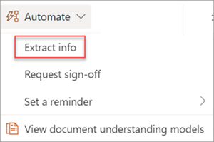
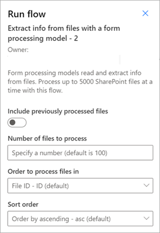

# Train a structured or freeform document processing model in Microsoft Syntex

<!---
Using [AI Builder](/ai-builder/overview)—a feature in Microsoft Power Apps—Syntex users can create a [structured document processing](form-processing-overview.md) model directly from a SharePoint document library. 
--->

Follow the instructions in [Create a model in Syntex](create-syntex-model.md) to create a structured or freeform document processing model in a content center. Or, follow the instructions in [Create a model on a local SharePoint site](create-local-model.md) to create the model on a local site. Then use this article to train your model.

To train a structured or freeform document processing model, follow these steps:

 - [Step 1: Add and analyze documents](#step-1-add-and-analyze-documents)
 - [Step 2: Tag fields and tables](#step-2-tag-fields-and-tables)
 - [Step 3: Train and publish your model](#step-3-train-and-publish-your-model)
 - [Step 4: Use your model](#step-4-use-your-model)

## Step 1: Add and analyze documents

After you create your structured or freeform document processing model, the **Choose information to extract** page opens. Here you list all pieces of information that you want the AI model to extract from your documents, such as *Name*, *Address*, or *Amount*.

> [!NOTE]
> When you look for example files to use, see the [document processing model input document requirements and optimization tips](/ai-builder/form-processing-model-requirements). 
 
1. You first define the fields and tables you want to teach your model to extract on the **Choose information to extract** page. For detailed steps, see [Define fields and tables to extract](/ai-builder/create-form-processing-model#define-fields-and-tables-to-extract). 

2.  You can create as many collections of document layouts you want your model to process. For detailed steps, see [Group documents by collections](/ai-builder/create-form-processing-model#group-documents-by-collections). 

3. After you create your collections and add at least five example files for each, AI Builder on Syntex will examine the uploaded documents to detect the fields and tables. This process usually takes a few seconds. When the analysis is complete, you can proceed with tagging the documents.

## Step 2: Tag fields and tables

You need to tag the documents to teach the model to understand the fields and table data you want to extract. For detailed steps, see [Tag documents](/ai-builder/create-form-processing-model#tag-documents).

## Step 3: Train and publish your model

1. After you create and train your model, you're ready to publish it and use it in SharePoint. To publish the model, select **Publish**. For detailed steps, see [Train and publish your document processing model](/ai-builder/form-processing-train). 

    

2. After the model is published, you will go to the model home page. You'll then have the option to apply the model to a document library.

    

## Step 4: Use your model

1. In the document library model view, notice that the fields you selected now display as columns.

    

2. Notice that the information link next to **Documents** notes that a forms processing model is applied to this document library.
<!---
      
--->
3. Upload files to your document library. Any files that the model identifies as its content type lists the files in your view and displays the extracted data in the columns.

     

> [!NOTE]
> If a structured or freeform document processing model and an unstructured document processing model are applied to the same library, the file is classified using the unstructured document processing model and any trained extractors for that model. If there are any empty columns that match the document processing model, the columns will be populated using those extracted values.

### Set a page range for processing

For this model, you can specify to process a range of pages for a file rather than the entire file. You do this under **Model settings**, in the **Page range** setting. By default, the **Page range** setting is empty. If no page range is provided, the entire document will be processed. For more information, see [Set a page range to extract information from specific pages](page-range.md).

### Classification Date field

When any custom model is applied to a document library, the **Classification Date** field is included in the library schema. By default, this field is empty. However, when documents are processed and classified by a model, this field is updated with a date-time stamp of completion.

When a model is stamped with the **Classification Date**, you can use the **Send an email after Syntex processes a file** flow to notify users that a new file has been processed and classified by a model in the SharePoint document library.

To run the flow:

1. Select a file, and then select **Integrate** > **Power Automate** > **Create a flow**.

2. On the **Create a flow** panel, select **Send an email after Syntex processes a file**.

     

### Use flows to extract information

> [!IMPORTANT]
> The information in this section doesn't apply to the latest release of Syntex. It is left as reference only for the form processing models that were created in previous releases. In the latest release, you no longer need to configure the flows to process existing files.

Two flows are available to process a selected file or batch of files in a library where a structured or freeform document processing model has been applied.

- **Extract info from an image or PDF file with a document processing model** — Use to extract text from a selected image or PDF file by running a document processing model. Supports a single selected file at a time, and supports only PDF files and image files (.png, .jpg, and .jpeg). To run the flow, select a file, and then select **Automate** > **Extract info**.

      

- **Extract info from files with a document processing model** — Use with document processing models to read and extract information from a batch of files. Processes up to 5,000 SharePoint files at a time. When you run this flow, there are certain parameters you can set. You can:

    - Choose whether to include previously processed files (the default isn't to include previously processed files).
    - Select the number of files to process (the default is 100 files).
    - Specify the order in which to process the files (choices are by file ID, file name, file created time, or last modified time).
    - Specify how you want the order sorted (ascending or descending order).

      
    
> [!NOTE]
> The **Extract info from an image or PDF file with a document processing model** flow is automatically available for a library with a document processing model associated. The **Extract info from files with a document processing model** flow is a template that must be added to the library if required.

