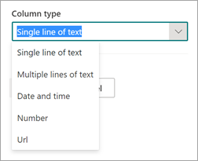
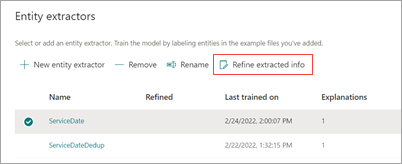
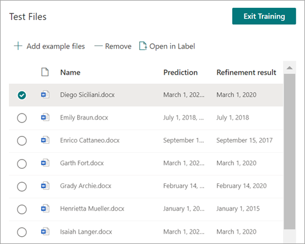

# Create an extractor in Microsoft Syntex

**Applies to:**  &ensp; &#10003; Unstructured document processing 

 

> [!VIDEO https://www.microsoft.com/videoplayer/embed/RE4CL2G]

 

Before or after you create a classifier model to automate identification and classification of specific document types, you can optionally choose to add extractors to your model to pull out specific information from these documents. For example, you might want your model not only to identify all *Contract Renewal* documents added to your document library, but also to display the *Service Start date* for each document as a column value in the document library.

You need to create an extractor for each entity in the document that you want to extract. In our example, we want to extract the **Service Start Date** for each **Contract Renewal** document that is identified by the model. We want to be able to see a view in the document library of all **Contract Renewal** documents, with a column that shows the **Service Start** date value of each document.

> [!NOTE]
> To create an extractor, you use the same files you previously uploaded to train the classifier.

## Name your extractor

1. From the model home page, in the **Create and train extractors** tile, select **Train extractor**.

2. On the **New entity extractor** screen, type the name of your extractor in the **New extractor name** field. For example, name it **Service Start Date** if you want to extract the service start date from each Contract Renewal document. You can also choose to reuse a previously created column (for example, a managed metadata column).

    By default, the column type is **Single line of text**. If you want to change the column type, select **Advanced settings** > **Column type**, and then select the type you want to use.

    

    > [!NOTE]
    > For extractors with the column type **Single line of text**, the maximum character limit is 255. Any characters that you select exceeding the limit get truncated. To select greater than 255 characters, choose the **Multiple lines of text** column type when creating the extractor.
    >
    >By default, **Multiple lines of text** columns are created with a limit to the amount of text that can be added. In this case, extracted text might appear truncated. If this occurs, the column setting **Allow unlimited length in document libraries** can be used to remove the limit.

3. When you're done, select **Create**.

## Add a label

The next step is to label the entity you want to extract in your example training files.

Creating the extractor opens the extractor page. Here you see a list of your sample files, with the first file on the list displayed in the viewer.

1. From the viewer, select the data that you want to extract from the files. For example, if you want to extract the *Start Service Date*, you highlight the date value in the first file (*Monday, October 14, 2022*). and then select **Save**. You should see the value display from the file in the Labeled examples list, under the **Label** column.
2. Select **Next file** to autosave and open the next file in the list in the viewer. Or select **Save** and then select another file from the **Labeled examples** list.
3. In the viewer, repeat steps 1 and 2, then repeat until you saved the label in all five files.

    

Once you labeled five files, a notification banner displays informing you to move to training. You can choose to more label more documents or advance to training.

### Use Find to search your file

You can use the **Find** feature to search for an entity in your document that you want to label.

   

The Find feature is useful if you're searching a large document or if there are multiple instances of the entity in the document. If you find multiple instances, you can select the one you need in the search results to go to that location in the viewer to label it.

## Add an explanation

For our example, we're going to create an explanation that provides a hint about the entity format itself and variations it might have in the sample documents. For example, a date value can be in several different formats, such as:

- 10/14/2022
- October 14, 2022
- Monday, October 14, 2022

To help identify the *Service Start Date*, you can create a pattern explanation.

1. In the Explanation section, select **New** and type a name (for example, *Date*).
2. For Type, select **Pattern list**.
3. For Value, provide the date variation as they appear in the sample files. For example, if you have date formats that appear as 0/00/0000, you enter any variations that appear in your documents, such as:
    - 0/0/0000
    - 0/00/0000
    - 00/0/0000
    - 00/00/0000
4. Select **Save**.

> [!NOTE]
> For more learn more about explanation types, see [Explanation types](./explanation-types-overview.md).

### Use the explanation library

For creating explanations for items such as dates, it's easier to [use the explanation library](./explanation-types-overview.md) than to manually enter all variations. The explanation library is a set of pre-built phrase and pattern explanations. The library tries to provide all formats for common phrase or pattern lists, such as dates, phone numbers, zip codes, and many others.

For the *Service Start Date* sample, it's more efficient to use the pre-built explanation for *Date* in the explanation library:

1. In the **Explanation section**, select **New**, and then select **From explanation library**.
2. From the explanation library, select **Date**. You can view all variations of date that are recognized.
3. Select **Add**.

    

4. On the **Create an explanation** page, the *Date* information from the explanation library auto fills the fields. Select **Save**.

    

## Train the model

Saving your explanation starts the training. If your model has enough information to extract the data from your labeled example files, you'll see each file labeled with **Match**.

If the explanation doesn't have enough information to find the data you want to extract, each file will be labeled with **Mismatch**. You can select **Mismatched** files to see more information about why there was a mismatch.

## Add another explanation

Often the mismatch is an indication that the explanation we provided didn't provide enough information to extract the service start date value to match our labeled files. You might need to edit it, or add another explanation.

For our example, notice that the text string *Start Service date of* always precedes the actual value. To help identify the Service Start Date, you need to create a phrase explanation.

1. In the Explanation section, select **New**, and then type a name (for example, *Prefix String*).
2. For the Type, select **Phrase list**.
3. Use *Service Start Date of* as the value.
4. Select **Save**.

    

## Train the model again

Saving the explanation starts the training again, this time using both explanations in the example. If your model has enough information to extract the data from the labeled example files, you see each file labeled with **Match**.

If you again receive a **Mismatch** on your labeled files, you likely need to create another explanation to provide the model more information to identify the document type, or consider making changes to your existing ones.

## Test your model

If you receive a match on your labeled sample files, you can now test your model on the remaining unlabeled example files. This step is optional, but useful to evaluate the "fitness" or readiness of the model before using it, by testing it on files the model hasn't seen before.

1. From the model home page, select the **Test** tab.  This will run the model on your unlabeled sample files.

2. In the **Test files** list, your example files display to show if the model is able to extract the information you need. Use this information to help determine the effectiveness of your classifier in identifying your documents.

    

## Further refine an extractor

If you have duplicate entities and want to extract only one value or a certain number of values, you can set a rule to specify how you want it processed. To add a rule to refine extracted information, follow these steps:

1. From the model home page, in the **Entity extractors** section, select the extractor you want to refine, and then select **Refine extracted info**.

    

2. On the **Refine extracted info** page, select one of the following rules:

    - Keep one or more of the first values
    - Keep one or more of the last values
    - Remove duplicate values
    - Keep one or more of the first lines
    - Keep one or more of the last lines

    

3. Enter the number of lines or values you want to use, and then select **Refine**.

4. If you want to edit a rule by changing the number of lines or values, select the extractor you want to edit, select **Refine extracted info**, change the number, and then select **Save**.

5. When you test the extractor, you'll be able to see the refinement in the **Refinement result** column of the **Test Files** list.

    

6. If you want to delete a refinement rule on an extractor, select the extractor from which you want to remove the rule, select **Refine extracted info**, and then select **Delete**.

## See also

[Create a classifier](create-a-classifier.md)

[Explanation types](explanation-types-overview.md)

[Leverage term store taxonomy when creating an extractor](leverage-term-store-taxonomy.md)

[Syntex accessibility mode](accessibility-mode.md)
