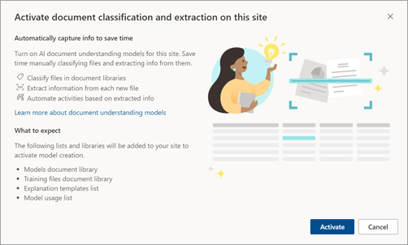
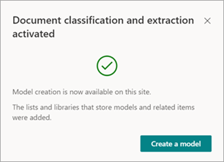
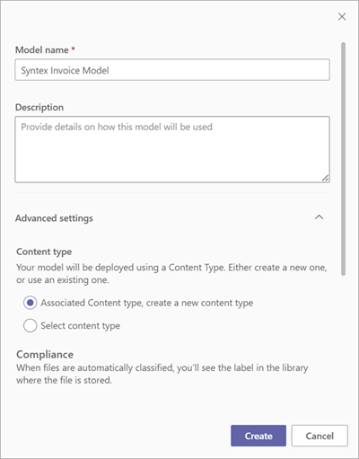

# Create a model on a local SharePoint site with Microsoft Syntex

**Applies to:**  &ensp; &#10003; All custom models &ensp; | &ensp; &#10003; All prebuilt models

Microsoft Syntex provides an option to create and train models locally on your own SharePoint site. These models can be used only on the site where they're created. 

> [!NOTE]
> If you want to make your model discoverable and available for other users, you need to [create an enterprise model](create-syntex-model.md). An enterprise model is a model that is created and trained in the [content center](create-a-content-center.md). Currently, information about [model usage analytics](model-usage-analytics.md) is only available for enterprise models.

By activating document classification and extraction on your SharePoint site, Syntex lets you classify files in document libraries, extract information from new files, and automate activities based on extracted information.

When you activate local model creation, the following lists and libraries will be added to your site:

- Models document library
- Training files document library
- Explanation templates list
- Model usage list

A model is automatically promoted to the current site only when the model first has been applied to any library in the site. This makes the model discoverable in the list of available site models and available for any other library in the site. Until the model is applied to a library in the site, it is unavailable. Similarly, when a model is removed from all the libraries in the site, it is also removed from the list of available site models. 

This feature is available for all [model types](model-types-overview.md). 

## Create a model on a local site

1. From a SharePoint document library, select the files you want to analyze, and then select **Classify and extract**.

     

2. The first time you use this feature, you're activating Syntex on your site. You'll see the following message.

     

    > [!NOTE]
    > You must have the Manage Web Site permission to perform administration tasks and manage content for the site. This would be a site owner. Once the feature is activated, anyone with the Manage Lists permission will be able to create and manage models.

3. Select **Activate** to continue. You'll see the following message.

     

4. Select **Create a model**.

5. On the **Create a model** panel, type the name of the model, add a description, and then select **Create**.

     

6. Proceed to [train your custom model](apply-a-model.md) or to [configure your trained model](prebuilt-overview.md) using the files that you selected.

7. When done, the **Add to library** panel opens.

     

8. On the **Add to library** panel, you'll see the name of your SharePoint site and the document library that the model will be applied to. If you want to apply the model to a different library, select **Back to libraries**, and choose the library you want to use. Then select **Add**.

9. On the model home page, in the **Where the model is applied on this site** section, you can see the libraries that have the model applied. To apply the model to other libraries on the site, select **Apply model**. 

     

> [!NOTE]
> When a local model is applied to a single library, it becomes available for discovery for application to other libraries in same site.
