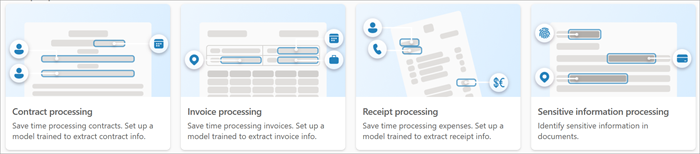

# Create an enterprise model in Microsoft Syntex

**Applies to:**  &ensp; &#10003; All custom models &ensp; | &ensp; &#10003; All prebuilt models

An enterprise model is created and trained in the [content center](create-a-content-center.md), and can be discovered by others to use. Whether you want to create a custom model or use a prebuilt model, you can do so from any of these places in Microsoft Syntex:

- From the **Models** library
- From the [content center](create-a-content-center.md) home page
- From any document library in a site where Syntex has been activated

For this article, we start in the **Models** library. For information about the different model types, see [Overview of model types in Syntex](model-types-overview.md).

If you want to create a local model, see [Create a model on a local SharePoint site](create-local-model.md).

## Create a model

From the **Models** library, select **Create a model**.

 

On the **Options for model creation** page, there are two sections:

- [**Train a custom model**](#train-a-custom-model)
    
- [**Set up a prebuilt model**](#set-up-a-prebuilt-model)

 

> [!NOTE]
> All model options might not be available. These options are configured by your Microsoft 365 admin.

## Train a custom model

The **Train a custom model** section shows the training method for the type of custom models you want to create.

 

- **Teaching method** – Creates an [unstructured document processing model](document-understanding-overview.md).

- **Freeform selection method** – Creates a [freeform document processing model](freeform-document-processing-overview.md).

- **Layout method** – Creates a [structured document processing model](form-processing-overview.md).

Select one of the following tabs to continue with the custom model you want to use.

# [Teaching method](#tab/teaching-method)

Use the **Teaching method** to create an [unstructured document processing model](document-understanding-overview.md).

1. Select **Teaching method**.

2. On the **Teaching method: Details** page, you'll find more information about the model. If you want to proceed with creating the model, select **Next**.

3. On the right panel of the **Create a model with the teaching method** page, enter the following information.

    - **Model name** – Enter the name of the model, for example *Service agreements*.

    - **Description** – Enter information about how this model will be used.

         
    
4. Under **Advanced settings**:

    - In the **Content type** section, choose whether to create a new content type or to use an existing one.

    - In the **Compliance** section, under **Retention labels**, select the retention label you want to add. Under **Sensitivity labels**, select the sensitivity label you want to add. If a compliance label has been already applied to the library where the file is stored, it will be shown.

5. When you're ready to create the model, select **Create**.

6. You're now ready to [train the model](create-a-classifier.md).

# [Freeform selection method](#tab/freeform-selection-method)

Use the **Freeform selection method** to create a [freeform document processing model](freeform-document-processing-overview.md).

1. Select **Freeform selection method**.

2. On the **Freeform selection method: Details** page, you'll find more information about the model. If you want to proceed with creating the model, select **Next**.

3. On the right panel of the **Create a model with the freeform selection method** page, enter the following information.

    - **Model name** – Enter the name of the model, for example *Service agreements*.

    - **Description** – Enter information about how this model will be used.

         
    
4. Under **Advanced settings**:

    - In the **Content type** section, choose whether to create a new content type or to use an existing one.

    - In the **Compliance** section, under **Retention labels**, select the retention label you want to add. If a compliance label has been already applied to the library where the file is stored, it will be shown.

    > [!NOTE]
    > Sensitivity labels are not available for **Freeform selection method** (freeform document processing models) at this time.

5. When you're ready to create the model, select **Create**.

6. You're now ready to [train the model](create-a-form-processing-model.md).

    > [!NOTE]
    > When published, this model type is available for reuse by others who do not own the model. Currently, this model can be edited and shared for editing only by the model owner.

# [Layout method](#tab/layout-method)

Use the **Layout method** to create a [structured document processing model](form-processing-overview.md).

1. Select **Layout method**.

2. On the **Layout method: Details** page, you'll find more information about the model. If you want to proceed with creating the model, select **Next**.

3. On the right panel of the **Create a model with the layout method** page, enter the following information.

    - **Model name** – Enter the name of the model, for example *Service agreements*.

    - **Description** – Enter information about how this model will be used.

         
    
4. Under **Advanced settings**:

    - In the **Content type** section, choose whether to create a new content type or to use an existing one.

    - In the **Compliance** section, under **Retention labels**, select the retention label you want to add. If a compliance label has been already applied to the library where the file is stored, it will be shown.

    > [!NOTE]
    > Sensitivity labels are not available for **Layout method** (structured document processing models) at this time.

5. When you're ready to create the model, select **Create**.

6. You're now ready to [train the model](create-a-form-processing-model.md).

    > [!NOTE]
    > When published, this model type is available for reuse by others who do not own the model. Currently, this model can be edited and shared for editing only by the model owner.

---

## Set up a prebuilt model

The **Set up a prebuilt model** section shows the types of prebuilt models you can use. 

 

- **Contract processing**
- **Invoice processing**
- **Receipt processing**
 
Select one of the following tabs to continue with the prebuilt model you want to use.

# [Contract processing](#tab/contract-processing)

1. Select **Contract processing**.

2. On the **Contract processing: Details** page, you'll find more information about the model. If you want to proceed with using the model, select **Next**.

3. On the right panel of the **Create a contract processing model** page, enter the following information.

    - **Model name** – Enter the name of the model, for example *Service agreement*.

    - **Description** – Enter information about how this model will be used.

         
    
4. Under **Advanced settings**:

    - In the **Content type** section, choose whether to create a new content type or to use an existing one.

    - In the **Compliance** section, under **Retention labels**, select the retention label you want to add. If a retention label has been already applied to the library where the file is stored, it will be selected. 

    > [!NOTE]
    > Sensitivity labels are not available for prebuilt models at this time.

5. When you're ready to create the model, select **Create**.

6. You're now ready to [complete setting up the model](prebuilt-model-contract.md).

# [Invoice processing](#tab/invoice-processing)

1. Select **Invoice processing**.

2. On the **Invoice processing: Details** page, you'll find more information about the model. If you want to proceed with using the model, select **Next**.

3. On the right panel of the **Create an invoice processing model** page, enter the following information.

    - **Model name** – Enter the name of the model, for example *Office expenses*.

    - **Description** – Enter information about how this model will be used.

         
    
4. Under **Advanced settings**:

    - In the **Content type** section, choose whether to create a new content type or to use an existing one.

    - In the **Compliance** section, under **Retention labels**, select the retention label you want to add. If a retention label has been already applied to the library where the file is stored, it will be selected. 

    > [!NOTE]
    > Sensitivity labels are not available for prebuilt models at this time.

5. When you're ready to create the model, select **Create**.

6. You're now ready to [complete setting up the model](prebuilt-model-invoice.md).

# [Receipt processing](#tab/receipt-processing)

1. Select **Receipt processing**.

2. On the **Receipt processing: Details** page, you'll find more information about the model. If you want to proceed with using the model, select **Next**.

3. On the right panel of the **Create a receipt processing model** page, enter the following information.

    - **Model name** – Enter the name of the model, for example *Office expenses*.

    - **Description** – Enter information about how this model will be used.

         
    
4. Under **Advanced settings**:

    - In the **Content type** section, choose whether to create a new content type or to use an existing one.

    - In the **Compliance** section, under **Retention labels**, select the retention label you want to add. If a retention label has been already applied to the library where the file is stored, it will be selected. 

    > [!NOTE]
    > Sensitivity labels are not available for prebuilt models at this time.

5. When you're ready to create the model, select **Create**.

6. You're now ready to [complete setting up the model](prebuilt-model-receipt.md).

---

