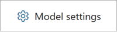
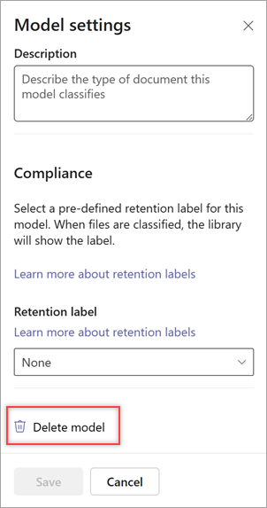
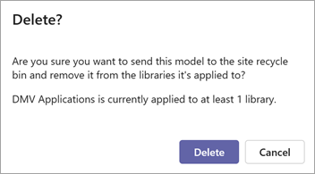

# Delete a model in Microsoft Syntex

**Applies to:**  &ensp; &#10003; All custom models &ensp; | &ensp; &#10003; All prebuilt models

At some point, you might want to delete a Syntex model if it's no longer being used, if it contains inaccurate or outdated information, or if it's taking up too much storage space.

> [!NOTE]
> Deleting a model doesn't delete the associated content type. 

## Delete a model from the model home page

This is the easiest method to use to delete a model. It deletes the model and automatically removes it from all of the document libraries where it has been applied.

1. On the home page of the model, select **Model settings**.

    

2. On the **Model settings** panel, at the bottom of the panel, select **Delete model**.

    

3. To confirm you want to delete the model, on the **Delete** screen, select **Delete**.

    

   > [!NOTE]
   > For freeform and structured models, this action doesn't delete the model in AI Builder. It only deletes it from the SharePoint document library in Syntex.

## Delete a model from the Models library

You can also delete a model from the **Models** library. However, before you delete the model, you must first remove the model from all of the document libraries where it has been applied.

1. Remove the model either from the model home page or from the document library by selecting **Automate** > **View applied models** > **Remove from library**.

   > [!NOTE]
   > If you try to delete a model that has been applied to one or more libraries, you will receive an error message indicating that you must first remove it from all libraries to which it's been applied.
 
2. From the **Models** library, select the model you want to delete.

3. By using either the ribbon or the **Show actions** button (next to the model name), select **Delete**. 

    

4. To confirm you want to delete the model, on the **Delete** screen, select **Delete**.

