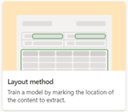

# Compare custom models in Microsoft Syntex 

Use the following table to see differences in custom models to help identify the most appropriate model to use for your needs.

| Feature | Unstructured document processing | Freeform document processing | Structured document processing |
| ------- | ------- | ------- | ------- |
| Associated with this training method in the UI   |  |  |  |
| Use for this type of content | Unstructured or semi-structured file formats, for example Office documents where there are differences in the layout, but still similar information to be extracted. | Unstructured and free-form file formats, for example documents that have no set structure such as letters, contracts, and statements of work. | Structured and semi-structured file formats, for example PDFs for forms content such as invoices or purchase orders where the layout and formatting is similar. |
| Model creation | Model created in SharePoint in a new site, the content center.  | Model created in [AI Builder](/ai-builder/overview) with seamless access from SharePoint document library.| Model created in [AI Builder](/ai-builder/overview) with seamless access from SharePoint document library. |
| Classification type | Trainable classifier with optional extractors using machine teaching to assign document location on what data to extract. | Not applicable | Not applicable |
| Locations | Can be applied to multiple libraries. | Can be applied to multiple libraries. | Can be applied to multiple libraries. |
| Supported file types | Train on 5-10 .pdf, Office, or email files, including negative examples. Files are truncated at 64,000 characters. OCR-scanned files are limited to 20 pages. Supports more than 20 file types. See [supported file types](requirements-and-limitations.md#unstructured-document-processing).  | Train on .pdf, .jpg, or .png format, total 50 MB and 500 pages. | Train on .pdf, .jpg, or .png format, total 50 MB and 500 pages. |
| Integrate with managed metadata | Yes, by training entity extractor referencing a configured managed metadata field. | No | No |
| Compliance feature integration with Microsoft Purview Information Protection | Set published retention labels. Set published sensitivity labels. | Set retention labels is coming.  Set sensitivity labels is coming. | Set published retention labels.  Set sensitivity labels is coming. |
| Supported regions| Available in all regions. | Relies on Power Platform. For information about global availability for Power Platform and AI Builder, see [Power Platform availability](https://dynamics.microsoft.com/geographic-availability/). | Relies on Power Platform. For information about global availability for Power Platform and AI Builder, see [Power Platform availability](https://dynamics.microsoft.com/geographic-availability/). |
| Transactional cost | Not applicable | Uses AI Builder credits. 3,500 credits are included for each Syntex license per month. 1 million credits will allow processing of 10,000 file pages. | Uses AI Builder credits. 3,500 credits are included for each Syntex license per month. 1 million credits will allow processing of 10,000 file pages. |
| Capacity | No capacity restrictions. | Uses the default Power Platform environment (custom environments with Dataverse database supported). | Uses the default Power Platform environment (custom environments with Dataverse database supported). |
| Supported languages| Models work on all Latin alphabet languages. In addition to English: German, Swedish, French, Spanish, Italian, and Portuguese. | Current language support is for English. | Language support for [more than 100 languages](/ai-builder/form-processing-model-requirements#languages-supported). |

