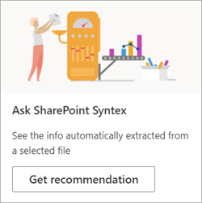
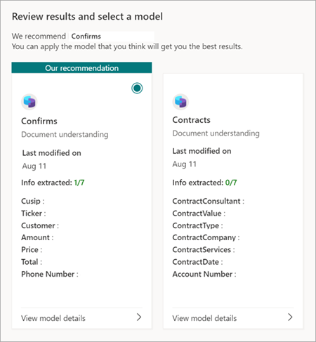

# Discover other trained models in Microsoft Syntex

**Applies to:**  &ensp; &#10003; All custom models &ensp; | &ensp; &#10003; All prebuilt models

Before you create a new model, you might consider whether to reuse an existing one. You can find and evaluate trained models that were created by others in your organization. This might include shared enterprise models trained in a content center or other local models created in the same site. Select the model that is most useful for classifying your files or extracting specific information from them. 

## Discover other trained models

To find trained models that might be suitable for your content:

1. In the document library for your model, select **Classify and extract**.

2. On the **Review models and apply new ones** page, you can review the applied models and the models that are available to be applied to your document library.

    

   - On the **Applied** tab, see the models that have been applied to your library. Select **View model details** to see information about the model, such as description, extractors, and other settings.
   
   - On the **Available** tab, see the trained models that are available to be applied to your library.

## Apply a trained model to your library

You can evaluate trained models against your content to help you find the most appropriate one. To select a model that you want to apply to your library:

1. On the **Review models and apply new ones** page, select the **Available** tab to review the models in the list.

    

2. Choose the model that you think will get you the best results, select **View model details**, and then select **Apply to library**.

## Get a recommendation for a trained model

If you're unsure which model is the best fit for your files, you can ask for a recommendation. Your recommendation could include up to 10 models.

1. On the **Review models and apply new ones** page, select the **Available** tab.

2. On the first tile, select **Get recommendation**.

    

3. On the **Select one or more models for analysis** page, select the models that you think might be the best fit, and then select **Next**.

    

4. On the **Select a file to analyze** page, select a file of the same or similar type that will be stored in your library. Then choose **Select**.

    

5. On the **Review results and select a model** page, under **Our recommendation**, you'll see the recommended file. You don't have to apply the recommended model. You can choose to apply another model if you think it's a better fit.

    

6. For the model you think will get you the best results, select **View model details**, and then select **Apply to library**.

7. If there are no recommended models based on the selected file, you can go back and select another file or select different models.

## Remove an applied model

> [!NOTE]
> A model has to be removed from all SharePoint document libraries before it can be [deleted](delete-a-model.md) or [renamed](rename-a-model.md).

To remove an applied model from your document library:

1. On the **Review models and apply new ones** page, on the **Applied** tab, see the models that have been applied to your library.

2. On the model you want to remove, select **View model details**, and then select **Remove from library**.

