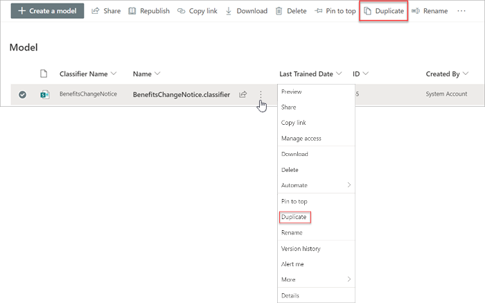
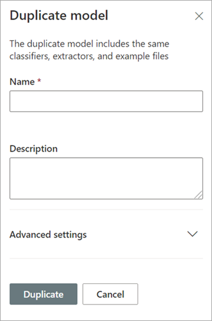

# Duplicate a model in Microsoft Syntex

**Applies to:**  &ensp; &#10003; Unstructured document processing 

Duplicating an unstructured document processing model can save you time and effort if you need to create a new model, and know that an existing model is very similar to what you need.

For example, an existing model named “Contracts” classifies the same files you need to work with. Your new model will extract some of the existing data, but will need to be updated to extract some additional data. Instead of creating and training a new model from scratch, you can use the duplicate model feature to make a copy of the Contracts model, which will also copy all associated training items, such as example files and entity extractors.

When you duplicate the model, after you rename it (for example, to “Contract Renewals”), you can then make updates to it. For example, you can choose to remove some of the existing extracted fields that you don’t need, and then train the model to extract a new one (for example, “Renewal date”).

## Duplicate a model

Follow these steps to duplicate an unstructured document processingmodel.

1. From the content center, select **Models** to see your models list.

2. On the **Models** page, select the model you want to duplicate.

3. By using either the ribbon or the **Show actions** button (next to the model name), select **Duplicate**. 

      

4. On the **Duplicate model** panel:

   a. Under **Name**, enter the new name of the model that you want to duplicate. 

      

   b. Under **Description**, add a description of your new model.

   c. (Optional) Under **Advanced settings**, select whether you want to associate an existing [content type](/sharepoint/governance/content-type-and-workflow-planning#content-type-overview).

5. Select **Duplicate**.

