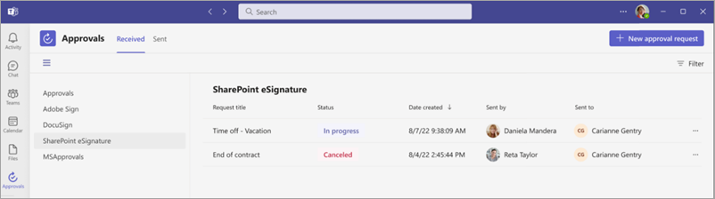
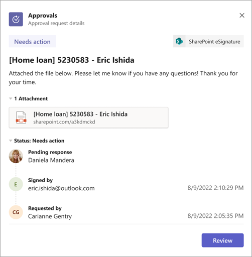
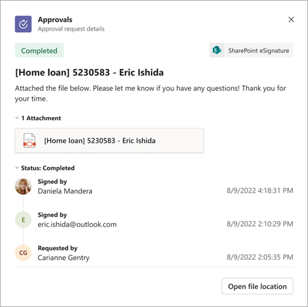

# Track and manage SharePoint eSignature requests using Approvals in Microsoft Teams

You can now track your SharePoint eSignature requests in Microsoft Teams. Whenever you send or receive an eSignature request, in addition to an email notification, you'll also receive notifications from Microsoft Teams via the Approvals app. You can see the latest status of eSignature requests, initiate signing, and get access to the SharePoint location where the signed document was saved to.

To view a list of your SharePoint eSignature requests, follow these steps:

1. In Microsoft Teams, select **Approvals**, and then select the **SharePoint** tab.

2. Use the filter option to search for the request or scroll through the request list.

3. Select a request to view more information about the request.

    

4. To sign the document, select **Review**.  

    

5. To access the document location, select **Open file location**.

    

> [!NOTE]
> As a recipient, only signature requests that originate from your tenant or within your organization will be visible in the Approvals app in Microsoft Teams. Requests from external senders can still be tracked via email notifications.  

## Tracking requests from other providers
You can track requests from other providers using similar steps previously described. Wile you will be able to see the status of the request and cancel it, you won't be able to access the signed document location from the Approvals app at this time.
