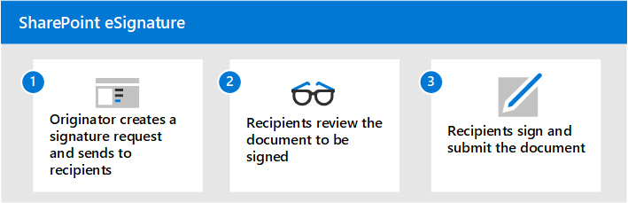

# Overview of SharePoint eSignature

> [!NOTE]
> Through June 2025, you can try out eSignature by sending up to five requests at no cost if you have [pay-as-you-go billing](syntex-azure-billing.md) set up. For information and limitations, see [Try out Microsoft Syntex and explore its services](promo-syntex.md).

SharePoint eSignature simplifies the process of signing and sharing documents, while providing the security and compliance of Microsoft 365.

With SharePoint eSignature, you can quickly and securely send documents for signature to people both inside and outside of your organization. You also have a digital audit trail, which can be used to verify the authenticity of documents and transactions.

## Regional availability

SharePoint eSignature is currently available in the US, UK, and Canada. By November 2024, it will be available to the EU and APAC, and it will be available globally in 2025.
<!---
Beginning September 2024, SharePoint eSignature will be rolling out to the UK, Canada, and the following European countries/regions: Austria, Belgium, Bulgaria, Croatia, Cyprus, Czechia, Denmark, Estonia, Finland, Greece, Hungary, Ireland, Latvia, Lithuania, Luxembourg, Malta, Poland, Portugal, Romania, Slovakia, Slovenia, and Sweden.

SharePoint eSignature will be available in the remaining European countries (France, Germany, Italy, the Netherlands, and Spain), as well as Australia and Asia-Pacific, by the end of 2024.

SharePoint eSignature will be available worldwide by the end of 2025.
--->
## Before you begin

### Legal considerations

SharePoint eSignature uses simple electronic signatures as defined under applicable law including, but not limited, to the Regulation (EU) No 910/2014 (the eIDAS Regulation). Determine whether this is appropriate for your needs and then read the [SharePoint eSignature terms of service](/legal/microsoft-365/esignature-terms-of-service).

### Licensing

Before you can use SharePoint eSignature, you must first link your Azure subscription in [Syntex pay-as-you-go](syntex-azure-billing.md). SharePoint eSignature is billed based on the [type and number of transactions](syntex-pay-as-you-go-services.md). Before you can enable SharePoint eSignature, an admin must [set up SharePoint eSignature](esignature-setup.md) in the Microsoft 365 admin center.

### External sharing

SharePoint eSignature enables binding agreements between parties by allowing guests access to SharePoint to electronically sign documents. Certain external sharing must be enabled at a tenant or site level to allow this access. For more information, see [Set up SharePoint eSignature for external recipients](esignature-setup.md#external-recipients). Consider whether this meets your compliance and security requirements when enabling eSignature.

## Using other signature providers

SharePoint eSignature is now integrated with other electronic signature providers, such as Adobe Acrobat Sign and DocuSign. You can initiate requests using these other providers from PDF documents in SharePoint, while ensuring the secure and automatic storage of signed documents in Microsoft 365. Other electronic signature providers will be added in the future.

The providers facilitate the signing process and send out all relevant notifications. When signing is complete, a copy of the fully signed document is automatically saved in SharePoint for easy access. For more information, see [how to add other signature providers](esignature-setup.md#add-other-signature-providers) and [how to create a signature request using another provider](esignature-send-requests.md#create-a-signature-request-using-another-provider).

## Release notes

- SharePoint eSignature is available for only PDF documents at this time.
- Tracking of SharePoint eSignature requests through the Approvals app in Microsoft Teams is now available.
- Support for Adobe Acrobat Sign and Docusign is now available. In the future, there will be potential integration with other electronic signature providers.

 

> [!div class="nextstepaction"]
> [Create a signature request](esignature-send-requests.md)
