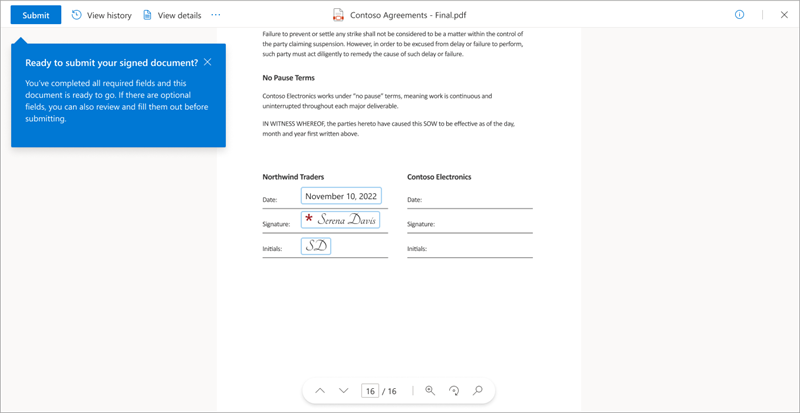
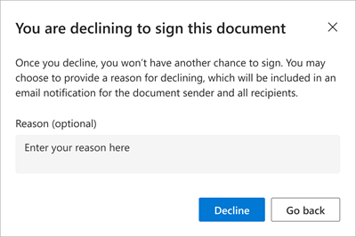
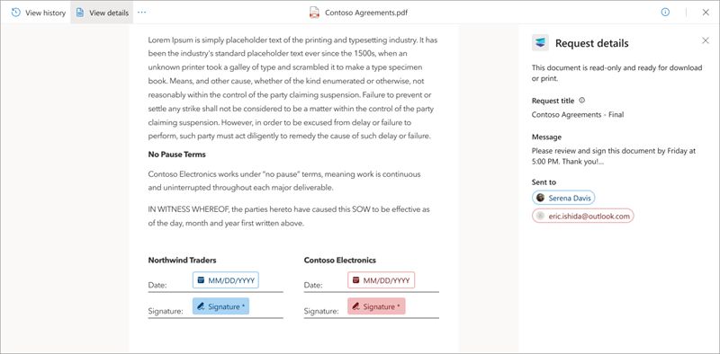

# Review and sign a signature request using Microsoft SharePoint eSignature

When a signature request is created, an email notification is sent to the recipients. The notification contains details of the request, including all recipients who are required to sign, and any signing instructions. A recipient doesn't need to have a SharePoint license or a Microsoft account to sign the request.

## Access the document to be signed

When you receive the email notification, select **View request** in the email to begin the signing process.

## Consent to use your electronic signature

To continue the electronic signing process, you must consent to the terms and conditions and agree to use your electronic signature for signing. On the **eSignature Terms and Conditions** screen:

- Select **Agree** to use your electronic signature and continue with the signing process.  
- Or select **Decline** if you'd prefer [not to use your digital signature](#decline-to-sign-the-document), and contact the person who requested your signature to complete the signature by using a different method.
- If you close the **eSignature Terms and Conditions** without selecting the **Agree** button, you can reopen the dialog by selecting the **View disclosure** button on the top-left area of the document.

    

## Sign the document

Once you accept the eSignature terms and conditions, the document viewer opens in a new browser tab. Here you can navigate and read the document, and review the content. When you’re ready to sign, select **Start**. This action brings you to the first location where your input is needed.  

There are three different types of input you can be asked for:

- [Signature](#signature)
- [Initials](#initials)
- [Date](#date)

### Signature

Electronic signatures let you digitally sign a document by enabling you to add a representation of your physical signature.  

1. To add your signature, type your name. If you want to choose a different font style for your signature, select **Change font** and choose the font you want to use.

    

2. Select **Done** to add your signature to the document.

3. Select **Next** to go to the next location in the document that requires your input.

    

### Initials

In some locations within the document, you might be asked to add your initials to acknowledge a particular clause.

1. Select **Initial here**, and enter your initials. This action is prepopulated if you've already entered your signature.

    

2. Select **Next** to go to the next location in the document that requires your input.

### Date

The date is prepopulated with the current day’s date.

## Submit the signed document

When you have entered all of the required input, select **Submit** to complete the signing process.

The status of the request changes from **In progress** to **Completed**. The document becomes read-only. You'll receive an email notification saying that your signature has been received and the requester will be notified.

Once everyone has signed the document, you'll receive an email notification saying where you can view the document and request details. The document is available via the **View request** button in the email for 30 days, so make sure you download it for your own records.

### Decline to sign the document

If you review the document and don’t want to sign it, you can decline to sign.

1. In the document viewer, select **More options** (...), and then select **Decline to sign**.

    

2. On the **You are declining to sign this document** screen, enter a reason for not signing document, and then select **Decline**. Or if you change your mind, select **Go back**.

    

Once you decline, you won't be able to add your signature, but you'll be able to see the document in read-only mode.
 
Once you decline, an email notification is sent to the requester saying that you don’t want to sign the document. Declining to sign will complete the signing process and change the status of the request from **In progress** to **Declined**.
  
If there are more recipients, they'll also receive a notification saying that the request has been declined.

### View request history and details

Whether you're a requester or a recipient, you can select **View request** from any of your email notifications to view the document and find out more about the request.

1. In the document viewer, select the **View history** tab to see the status of the request. On the **Request history** panel, you can see the recipients who haven't signed yet and the activities that have happened so far, such as when the request was created and who the recipients are.

    

2. Select the **View details** tab to see the details of the request. On the **Request details** panel, you can see the title of the request, any instructions the requester added when sending the request, and who the request was sent to.

    

## Monitor the status of a request

When you create a signature request with SharePoint eSignature, it goes through different stages that are reflected in the request statuses. You can view the status of a request by selecting **View request** in any of the email notifications you received about the signature request. The following table shows the request statuses and their meaning.

|Status  |Description  |
|---------|---------|
|**In&nbsp;progress**  |The request is in progress as soon as it's created. The status remains at this state until the request has been reviewed by all recipients or canceled by the sender of the request.|
|**Completed**  |The request is completed when all recipients have signed the document. |
|**Canceled**   |The request has been canceled by the sender. |
|**Declined**   |One of the recipients has declined to sign.|

When the status of a request is **Completed**, **Canceled**, or **Declined**, the request can no longer be acted on by either the sender or the recipients. As an example, if a recipient declines a request, the sender would need to send a new request after the reason for declining has been addressed. The original declined request can't be edited.

## Unable to sign a document as an external recipient
When you receive a document for signing from someone outside of your organization, you might be able to access and read the document but the signing operation fails when you attempt to sign it. Other times, you might not be able to access and read the document. If you're experiencing any issues with signing a document sent from someone outside your organization, contact the sender who will be able to resolve the issue.

## Access the signed document

All parties involved in the request receive an email notification saying that the request has been completed and the status of the request is **Completed**. In the email, you can select **View signed document** to access the signed document and the request history. Signers can continue to access and download the signed document from the email notification for 30 days after receiving the email. Additionally, request senders will be able to access the originating folder in which the signed document was saved directly from the email.  

> [!NOTE]
> When you open a PDF document on a SharePoint site, you won't see the details of the request if your default PDF viewer is set to Adobe. You'll need to set PDF viewer as your default viewer.

## Security of the signed document

After all recipients have signed the document, the signatures are added and an audit trail is appended to the signed PDF. Details of the request, including activities and timestamps of when they occurred throughout the signing process, are included. The details include the date and time the request created, date and time when the recipients signed, and so on. These details provide evidence of the integrity of the signing process. The signed document is then digitally signed by a Microsoft certificate to ensure that it can't be tampered with.  

