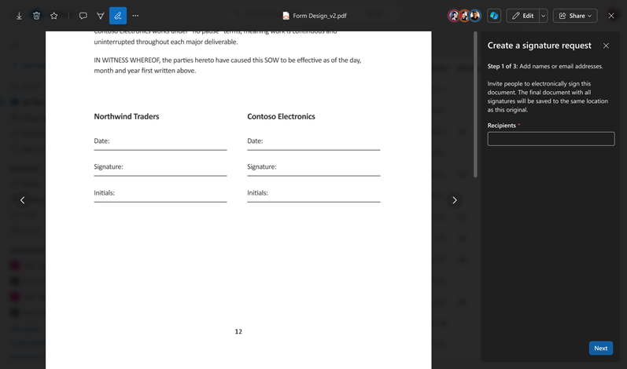
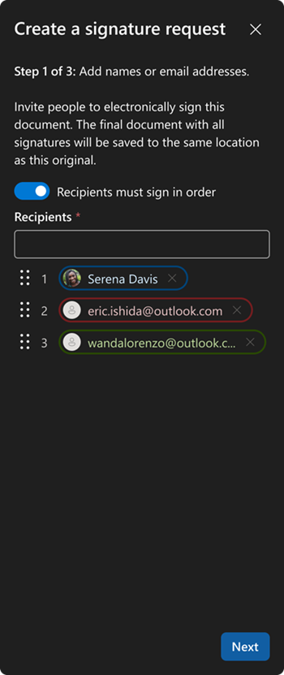
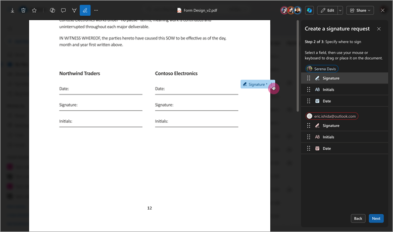
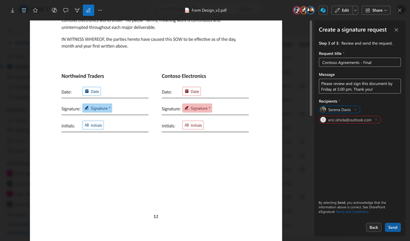
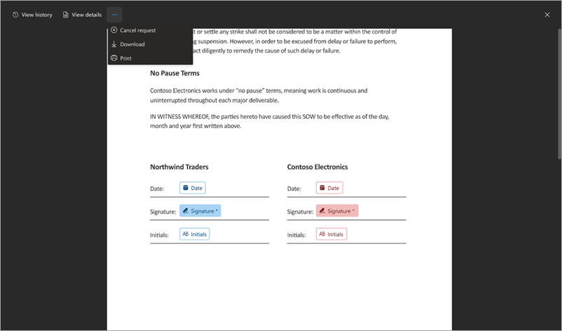
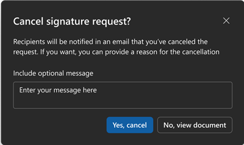
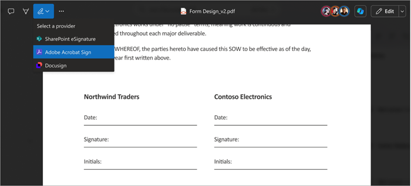

# Create a signature request using SharePoint eSignature

## Create a signature request

Use the following steps to start the SharePoint eSignature process. You must be signed in to SharePoint by using your work email address.

1. From a SharePoint document library, open the document for which you want to start the eSignature process.

2. In the document viewer, select the pen icon.

    

3. On the **Create a signature request** panel, add up to 10 internal or external recipients you want to sign the document. If the recipients need to sign in order, turn on the **Recipients must sign in order** toggle. You can change the order of the recipients by dragging and dropping them to the correct order. Then select **Next**.

    

4. On the **Create a signature request** panel (step 2 of 3), drag and drop the **Signature**, **Initials**, and **Date** fields to the appropriate locations in the document for each recipient. Each form field can be marked either as required or not required.

    

5. Select **Next** to progress to the next stage. At least one required signature field is needed for each recipient. Up to 50 fields (total) can be added to the document.

6. On the **Create a signature request** panel (step 3 of 3), enter a title for the request, add an optional message, and review the details on the panel to make sure it's correct. Then select **Send**.

    

    Once sent, the status of the request is set to **In progress**.  An email notification is sent to the creator and the recipients. If **Recipients must sign in order** is toggled on, recipients will be able to add their signature in the order specified, otherwise they can add their signature in any order.  

#### Track and manage other provider requests

Managing ongoing eSignature requests for other providers is done on the provider website or through the Approvals app in Microsoft Teams. You'll also be notified by email from the provider throughout the signing process.

## Cancel a signature request

If you create a signature request and want to cancel it, follow these steps.

1. From one of your email notifications, select **View Request**.

2. When the document is open in the document viewer, select **More options** (...), and then select **Cancel request**.

    

3. On the **Cancel signature request** confirmation screen, enter a message detailing why the request is canceled if needed, and then select **Yes, cancel**.

    

    Once canceled, the status of the request is set to **Canceled** and recipients receive an email notification telling them that the request was canceled and that no further action is possible on this request.

### Create a signature request using another provider

Use the following steps to start an electronic signature in SharePoint using another provider, such as Adobe Acrobat Sign or DocuSign.

1. From a SharePoint document library, open the document you want to start the eSignature process.

2. In the document viewer, select the eSignature icon, and then select the provider you want to use from the menu.

    

3. You'll be prompted to sign in to the provider using your sign-in credentials the first time. For subsequent requests, you might not need to sign in again.

4. After successful sign in, you'll be prompted to continue on the provider's website.

5. The document is automatically transferred to the provider service.

6. The provider's website opens in another browser tab.

7. On the new tab, proceed with the request creation process as you normally would.
   
9. Once completed, you can close all document tabs.
    
10. To cancel or track a request from other providers, you can do this in the Approvals app in Teams or via the provider's website.

 

> [!div class="nextstepaction"]
> [Review and sign a request](esignature-review-sign-requests.md)
