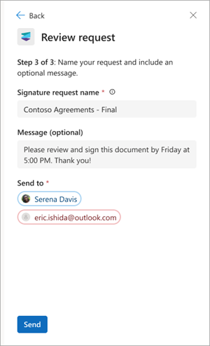
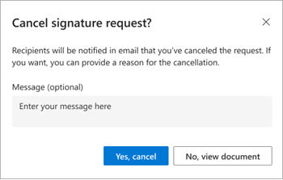
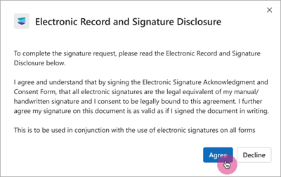
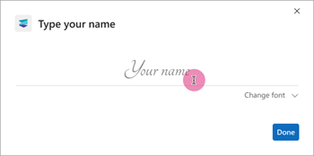

# Create, review, and sign signature requests using Microsoft Syntex eSignature (Preview)

> [!NOTE]
> This feature is currently in limited preview and subject to change.

Microsoft Syntex eSignature simplifies the process of signing and sharing documents, while providing the security and compliance of Microsoft 365.

With Syntex eSignature, you can quickly and securely send documents for signature to people both inside and outside of your organization. You'll also have a digital audit trail, which can be used to verify the authenticity of documents and transactions.

## Before you begin

Before you can use Syntex eSignature, an admin must [set up the Syntex eSignature service](esignature-setup.md) in the Microsoft 365 admin center.

You must be signed in to SharePoint Online by using your work email address.

> [!NOTE]
> For this preview, Syntex eSignature is available for PDF documents only at this time.

## Create a signature request

1. From a SharePoint document library, open the document for which you want to start the Syntex eSignature process.

2. In the document viewer, select **More options** (...), and then select **Get signatures**.

    

3. On the **Syntex eSignature** panel, add up to 10 internal or external recipients you want to sign the document, and then select **Next**.

    

4. On the **Add form fields** panel, drag and drop the **Signature**, **Initials**, and **Date** fields to the appropriate locations in the document for each recipient. Each form field can be marked either as required or not required.

    

5. Select **Next** to progress to the next stage. At least one required signature field is needed for each recipient. Up to 50 fields (total) can be added to the document.

6. On the **Review request** panel, enter a title for the request, add an optional message, and review the details on the panel to make sure it's correct. Then select **Send**.

    

    Once sent, the status of the request is set to **In progress** and recipients are able to add their signatures.

### Unable to create a request

If you aren't able to create a signature request, check the PDF viewer settings or the collaboration settings.

#### PDF settings from the PDF viewer

The PDF viewer is opened by selecting a PDF file from SharePoint Online. The ability to request signatures won't be available if the PDF is viewed in any other way (for example, in Microsoft Edge). If  PDF files are opened in any other way, the **Get signatures** option isn't available.

#### Collaboration settings

Syntex eSignature is an extension of SharePoint document storage and management service. Therefore, all existing access, sharing, and data loss prevention policies that are already applied at the tenant level, SharePoint site and library level, or folder and file level might affect whether a request can be started from a document in SharePoint and who it can be sent to. Some of the scenarios that might affect the signature request process are:

- The document has a sensitivity label applied that restricts access or sharing. This event limits who can start signature request with that document or the recipients that it can be sent to, depending on the label settings and the user's role.

- The document is stored in a library or folder that has unique permissions or sharing settings. This event might override the default settings of the SharePoint site or tenant and either allow or block certain users from initiating or accessing an eSignature request with that document.

- Microsoft Entra ID collaboration settings restrict document sharing to specific individuals. This event limits who the requests can be sent to.

### Cancel a signature request

If you create a signature request and want to cancel it, follow these steps.

1. From one of your email notifications, select **View Request**.

2. When the document is open in the document viewer, select **More options** (...), and then select **Cancel request**.

    

3. On the **Cancel signature request** confirmation screen, enter a message detailing why the request is canceled if needed, and then select **Yes, cancel**.

    

    Once canceled, the status of the request is set to **Canceled** and recipients receive an email notification telling them that the request was canceled and that no further action is possible on this request.

## Review and sign a signature request

When a signature request is created, an email notification is sent to the recipients. The notification contains details of the request, including all recipients who are required to sign, and any signing instructions. A recipient doesn't need to have a Syntex license or a Microsoft account to sign the request.

### Access the document to be signed

When you receive the email notification, select **View signed document** in the email to begin the signing process.

### Consent to use your electronic signature

To continue the electronic signing process, you must consent to the terms and conditions and agree to use your electronic signature for signing. On the **Electronic Record and Signature Disclosure** screen:

- Select **Agree** to use your electronic signature and continue with the signing process.  
- Or select **Decline** if you'd prefer [not to use your digital signature](#decline-to-sign-the-document), and contact the person who requested your signature to complete the signature by using a different method.
- If you close the **Electronic Record and Signature Disclosure** without selecting the **Agree** button, you can reopen the dialog by selecting the **View disclosure** button on the top-left area of the document.

    

### Sign the document

Once you give your consent, the document viewer opens in a new browser tab. Here you can navigate and read the document, and review the content. When you’re ready to sign, select **Start**. This action brings you to the first location where your input is needed.  

There are three different types of input you can be asked for:

- [Signature](#signature)
- [Initials](#initials)
- [Date](#date)

#### Signature

Electronic signatures let you digitally sign a document by enabling you to add a representation of your physical signature.  

1. To add your signature, type your name. If you want to choose a different font style for your signature, select **Change font** and choose the font you want to use.

    

2. Select **Done** to add your signature to the document.

3. Select **Next** to go to the next location in the document that requires your input.

    

#### Initials

In some locations within the document, you might be asked to add your initials to acknowledge a particular clause.

1. Select **Initial here**, and enter your initials. This action is prepopulated if you've already entered your signature.

    

2. Select **Next** to go to the next location in the document that requires your input.

#### Date

The date is prepopulated with the current day’s date.

### Submit the signed document

When you have entered all of the required input, select **Submit** to complete the signing process.

The status of the request changes from **In progress** to **Completed**. The document becomes read-only. You'll receive an email notification saying that your signature has been received and the requester will be notified.

Once everyone has signed the document, you'll receive an email notification saying where you can view the document and request details. The document is available via the **View request** button in the email for 30 days, so make sure you download it for your own records.

### Decline to sign the document

If you review the document and don’t want to sign it, you can decline to sign.

1. In the document viewer, select **More options** (...), and then select **Decline to sign**.

    

2. On the **You are declining to sign this document** screen, enter a reason for not signing document, and then select **Decline**. Or if you change your mind, select **Go back**.

    

Once you decline, you won't be able to add your signature, but you'll be able to see the document in read-only mode.
 
Once you decline, an email notification is sent to the requester saying that you don’t want to sign the document. Declining to sign will complete the signing process and change the status of the request from **In progress** to **Declined**.
  
If there are more recipients, they'll also receive a notification saying that the request has been declined.

### View request history and details

Whether you're a requester or a recipient, you can select **View request** from any of your email notifications to view the document and find out more about the request.

1. In the document viewer, select the **View history** tab to see the status of the request. On the **Request history** panel, you can see the recipients who haven't signed yet and the activities that have happened so far, such as when the request was created and who the recipients are.

    

2. Select the **View details** tab to see the details of the request. On the **Request details** panel, you can see the title of the request, any instructions the requester added when sending the request, and who the request was sent to.

    

## Monitor the status of a request

When you create a signature request with Syntex eSignature, it goes through different stages that are reflected in the request statuses. You can view the status of a request by selecting **View request** in any of the email notifications you received about the signature request. The following table shows the request statuses and their meaning.

|Status  |Description  |
|---------|---------|
|**In&nbsp;progress**  |The request is in progress as soon as it's created. The status remains at this state until the request has been reviewed by all recipients or canceled by the sender of the request.|
|**Completed**  |The request is completed when all recipients have signed the document. |
|**Canceled**   |The request has been canceled by the sender. |
|**Declined**   |One of the recipients has declined to sign.|

When the status of a request is **Completed**, **Canceled**, or **Declined**, the request can no longer be acted on by either the sender or the recipients. As an example, if a recipient declines a request, the sender would need to send a new request after the reason for declining has been addressed. The original declined request can't be edited.

## Access the signed document

All parties involved in the request receive an email notification saying that the request has been completed and the status of the request is **Completed**. In the email, you can select **View request** to access the signed document and the request history. Access to the document via the email notification will be available for 30 days after the request is completed.

Additionally, the signed document also is saved to the folder where the original PDF is located (originating folder). It will be a read-only document with the permissions of the originating folder. The document can be accessed by the requester and anyone who has access to the originating folder.

> [!NOTE]
> When you open a PDF document on a SharePoint site, you won't see the details of the request if your default PDF viewer is set to Adobe. You'll need to set PDF viewer as your default viewer.

### Unable to access the signed document

Before a signature request is sent and at the completion of the request, certain checks are done to ensure that the sender has the permission to write to the document and the originating folder. If the permission changes when the signature request is in progress, the service might not be able to save a copy of the signed document in the originating folder. This event can happen when:

- The sender of the request no longer has access to the originating folder. For example, the sender’s access has been revoked by the owner of the originating folder or a SharePoint admin.

- Initial write permission of the sender to the originating folder was downgraded to view only.

- The originating folder was deleted.

To avoid potential issues, you should check the status and settings of their documents before starting a signature request. Ensure that there are sufficient permissions and roles to access and share the documents with their intended recipients.

- Data loss prevention (DLP) policies
- Microsoft Entra ID collaboration settings
- SharePoint sharing settings and policies
- User permissions and document access

## Security of the signed document

After all recipients have signed the document, the signatures are added and an audit trail is appended to the signed PDF. Details of the request, including activities and timestamps of when they occurred throughout the signing process, are included. The details include the date and time the request created, date and time when the recipients signed, and so on. These details provide evidence of the integrity of the signing process. The signed document is then digitally signed by a Microsoft certificate to ensure that it can't be tampered with.  

For setup and technical information for admins, see [Set up Microsoft Syntex eSignature (Preview)](esignature-setup.md).

