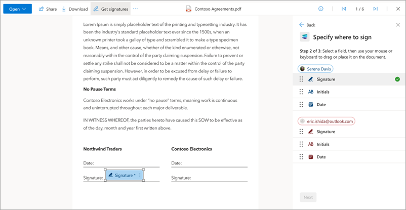
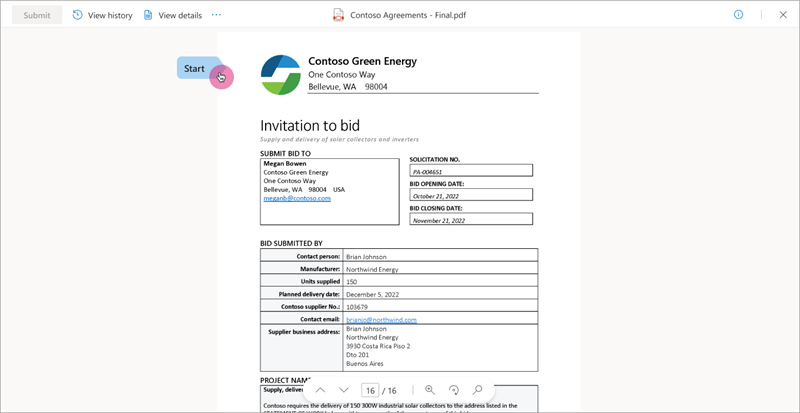
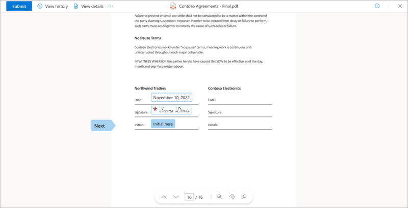
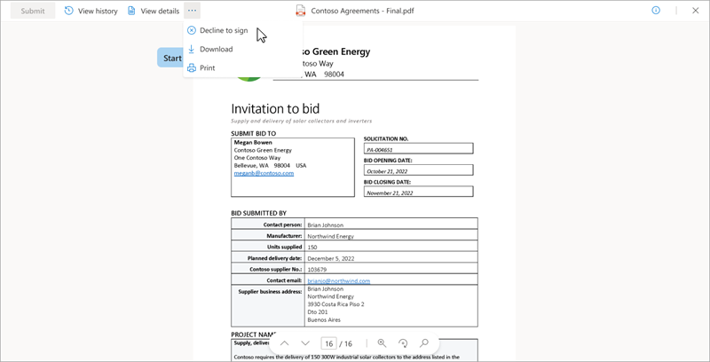
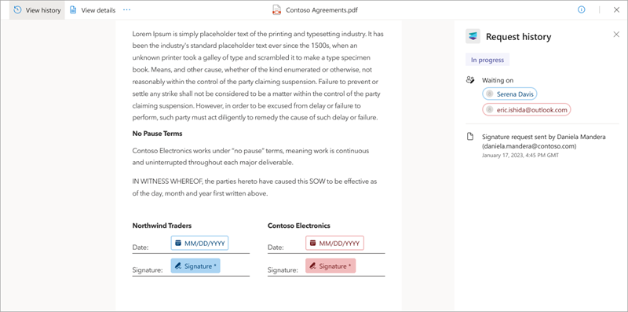

# Create, review, and sign signature requests using Microsoft Syntex eSignature (Preview)

> [!NOTE]
> This feature is currently in limited preview and subject to change.

Microsoft Syntex eSignature lets you safely and easily send PDF documents for signature to multiple recipients. It allows you to add a message and edit the name of the request, and to send it to multiple recipients while leveraging the security and compliance of Microsoft 365.

## Before you begin

Before you can use Syntex eSignature, an admin must [set up the Syntex eSignature service](esignature-set-up) in the Microsoft 365 admin center.

You must be signed in to SharePoint Online with your work email.

## Create a signature request

1. From a SharePoint document library, open the file for which you want to start the Syntex eSignature process.

2. In the document viewer, select **More options** (...), and then select **Get signatures**.

    

3. On the **Add recipients** panel, add up to 10 internal or external recipients you want to sign the document, and then select **Next**.

    

4. On the **Add form fields** panel, drag and drop the **Signature**, **Initials**, and **Date** fields to the appropriate locations in the document for each recipient. Then select **Next**. At least one signature field is needed for each recipient. Up to 50 fields (total) can be added to the document.

    

5. On the **Review request** panel, enter a title for the request, add an optional message, and review the details on the panel to make sure it is correct. Then select **Send**.

    

    Once sent, the status of the request is set to **In progress** and recipients will be able to add their signatures.

### Troubleshoot creating requests

#### PDF settings from the PDF viewer

The PDF viewer is opened by selecting a PDF file from SharePoint Online. The ability to request signatures won't be available if the PDF is viewed in any other way (for example, in Microsoft Edge). If  PDF files are opened in any other way, the **Get signatures** option is not available.

#### Collaboration settings

Syntex eSignature is an extension of SharePoint document storage and management service. Therefore, all existing access, sharing, and data loss prevention policies that are already applied at the tenant, SharePoint site and library, folder and file level might impact whether a request can be started from a document in SharePoint and who it can be sent to. Some of the scenarios that might affect the signature request process are:

- The document has a sensitivity label applied that restricts access or sharing. This will limit who can start signature request with that document or the recipients that it can be sent to, depending on the label settings and the user's role.

- The document is stored in a library or folder that has unique permissions or sharing settings. This might override the default settings of the SharePoint site or tenant and either allow or block certain users from initiating or accessing an eSignature request with that document.

- Azure Active Directory (AAD) collaboration settings restrict document sharing to specific individuals. This will limit who the requests can be sent to.

### Cancel a signature request

If you create a signature request and want to cancel it, following these steps.

1. From one of your notification emails, select **View Request**.

2. When the document is open in the document viewer, select **More options** (...), and then select **Cancel request**.

    

3. On the **Cancel signature request** confirmation screen, enter a message detailing why the request is canceled if needed, and then select **Yes, cancel**.

    

    Once canceled, the status of the request is set to **Canceled** and recipients will receive a notification email telling them that the request was cancelled and that no further action will be possible on this request.

## Review and sign a signature request

When a signature request is created, a notification email is sent to the recipients. The notification email contains details of the request, including all recipients who are required to sign, and any signing instructions. A recipient doesn't need to have a Syntex eSignature or Microsoft account to sign the request. This section summarizes how a recipient can add their signature to a document.

### Access the document to be signed

When you receive the notification email, select **View request** to begin the signing process.

### Consent to use your electronic signature

To continue the electronic signing process, you must consent to the terms and conditions and agree to use your electronic signature for signing. On the **Electronic Record and Signature Disclosure** screen:

- Select **Agree** to use your electronic signature and continue with the signing process.  
- Or select **Decline** if you'd prefer not to use your digital signature, and contact the person who requested your signature to complete the signature by using a different method.

### Sign the document

Once you give your consent, the document viewer will open in a new browser tab. Here you can navigate and read the document, and review the content. When you’re ready to sign, select **Start**. This will bring you to the first location where your input is needed.  

There are three different types of input you can be asked for:

- Signature
- Initials
- Date

#### Signature

Electronic signatures let you digitally sign a document by enabling you to add a representation of your physical signature.  

1. To add your signature, type your name. If you want to choose a different font style for your signature, select **Change font** and choose the font you want to use.

    

2. Select **Done** to add your signature to the document.

    
	 
3. Select **Next** to go to the next location in the document that requires your input.

#### Initials

In some locations within the document, you might be asked to add your initials to acknowledge a particular clause.

1. Select **Initial here**, and enter your initials. This will be prepopulated if you have already entered your signature.

    

2. Select **Next** to go to the next location in the document that requires your input.

#### Date

The date will be prepopulated with the current day’s date.

When you have entered all of the required input, select **Submit** to complete the signing process.

The status of the request will change from **In progress** to **Completed**. The document will become read-only. You will get an email notification that your signature has been received and the requester will be notified.

Once everyone has signed the document, you will get an email notification where you can view the document and request details. The document is available via the **View request** button in the email for 30 days, so make sure you download it for your own records.

### Decline to sign the document

If you review the document and don’t want to sign it, you can decline to sign.

1. In the document viewer, select **More options** (...), and then select **Decline to sign**.

    

2. On the **You are declining to sign this document** screen, enter a reason for not signing document, and then select **Decline**. Or if you change your mind, select **Go back**.

    

Once you decline, you won't be able to add your signature but you will be able to see the document in read-only mode.
 
Once you decline, a notification is sent to the requester saying that you don’t want to sign the document. Declining to sign will complete signing process and change the status of the request from **In progress** to **Declined**.
  
If there are additional recipients, they'll also receive a notification saying that the request has been declined.

### View request history and details

Whether you are a requester or a recipient, you can select **View request** from any of your notification emails to view the document and find out more about the request.

1. In the document viewer, select the **View history** tab to see the status of the request. On the **Request history** panel, you can see the recipients who haven't signed yet and the activities that have happened so far, such as when the request was created and who the recipients are.

    

2. Select the **View details** tab to see the title of the request, any instructions the requester added when sending the request, and who the request was sent to.

    

## Signature statuses

