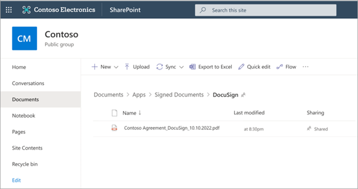

# Set up SharePoint eSignature

> [!NOTE]
> SharePoint eSignature is available in selected regions. If a tenant's location is a supported region, SharePoint eSignature will be available for that tenant. For multi-geo enabled tenants in supported regsions, eSignature will be available in the home geo only.  SharePoint eSignature will roll out to [other regions](esignature-overview.md#regional-availability) later this year.

The SharePoint eSignature service is set up in the Microsoft 365 admin center. Before you begin, determine whether this feature is appropriate for your needs by reading the [Before you begin section](esignature-overview.md#before-you-begin).

## Prerequisites

### Licensing

Before you can use SharePoint eSignature, you must first link an Azure subscription in [Syntex pay-as-you-go](syntex-azure-billing.md). Taxonomy tagging in Syntex is billed based on the [type and number of transactions](syntex-pay-as-you-go-services.md).

### Permissions

You must be a [SharePoint Administrator](/entra/identity/role-based-access-control/permissions-reference#sharepoint-administrator) or [Global Administrator](/entra/identity/role-based-access-control/permissions-reference#global-administrator) to be able to access the Microsoft 365 admin center and set up SharePoint eSignature.

[!INCLUDE [global-administrator-note](../includes/global-administrator-note.md)]

> [!NOTE]
> If you will be requesting signatures from external recipients, you need to enable [Microsoft Entra B2B integration for SharePoint and OneDrive](/sharepoint/sharepoint-azureb2b-integration) and [guest sharing](/microsoft-365/solutions/collaborate-in-site). External recipients are people outside your organization and would be onboarded as guests into your tenant. Microsoft Entra B2B provides authentication and management of guests. For more information, see [External recipients](#external-recipients) later in this article.

## Set up SharePoint eSignature

1. In the Microsoft 365 admin center, select <a href="https://go.microsoft.com/fwlink/p/?linkid=2171997" target="_blank">**Setup**</a>.

2. Under **Files and content**, select **Automate content processes with Syntex**.

3. On the **Automate content processes with Syntex** page, select **Go to Syntex settings**.

4. On the Syntex page, in the **Document & image services** section, select **eSignature**.

5. For existing customers, read the [terms of service](/legal/microsoft-365/esignature-terms-of-service), and then select **Turn on** to enable the service.

6. For new Syntex customers, the SharePoint eSignature service is turned on once you enter your billing information and accept the [terms of service](/legal/microsoft-365/esignature-terms-of-service). On the **eSignature** page:

   - To turn off the service, select **Turn off**.
   - To manage which sites the service is available, see [Manage sites](#manage-sites).

### Manage sites

By default, SharePoint eSignature is turned on for libraries in all SharePoint sites. Follow these steps to limit which sites users can use eSignature.

1. On the Syntex page, in the **Document & image services** section, select **eSignature**.

2. On the **eSignature** panel, under **Sites where eSignature can be used**, select **Select sites**.

    a. Choose the site or sites on which this service should be enabled.

    b. To restrict user access to this service, select **No sites** or **Selected sites (up to 100)**. Follow the instructions to either select the sites or upload a CSV listing a maximum of 100 sites. Be sure to add your content center site if you want it to be included. You can then manage site access permissions for the sites you selected.

    c. Select **Save**.

> [!NOTE]
> The first eSignature request in a Microsoft 365 tenant might take a little longer to execute than usual. It can take a few seconds to a few minutes; however, subsequent requests are executed normally. We recommend that admins create the first eSignature request in a SharePoint site as the final setup step.

### Turn off eSignature

1. On the Syntex page, in the **Document & image services** section, select **eSignature**.

2. If SharePoint eSignature is turned on, on the **eSignature** panel, the **Turn off** button is visible. To turn off SharePoint eSignature, select **Turn off**.

### Add other signature providers

1. On the Syntex page, in the **Document & image services** section, select **eSignature**.

2. On the **eSignature** panel, under **Other signature providers**, select **Add or remove signature providers**.

3. On the **Add or remove other signature providers** panel, select the provider you want to add.

    

4. Select **Save**.

> [!NOTE]
> Although [pay-as-you-go billing](syntex-azure-billing.md) must be set up to use eSignature, you are not charged for using other signature providers.

## External recipients

### Microsoft Entra B2B

Microsoft Entra B2B provides authentication and management of guests. External signers or recipients are considered as guests within your tenant. To be able to send requests to signers outside your organization, you need to enable [Microsoft Entra B2B integration for SharePoint and OneDrive](/sharepoint/sharepoint-azureb2b-integration). You would need to resend the eSignature request if a guest user is deleted from the tenant while a signature request is still ongoing. The guest user would no longer be able to access the request document or the final signed document. If you need to delete a guest user, make sure they aren't a party to any ongoing request.

### Authentication

External recipients might need to authenticate before they're able to access a document for signing. The type of authentication required by the external recipients depends on the configuration for guests at the SharePoint level or at the tenant level. Additionally, if the guest belongs to an organization with a Microsoft 365 tenant, it's possible for their organization's setup to affect their authentication experience when attempting to sign the document. For more information, see [Collaboration with guests in a site](/microsoft-365/solutions/collaborate-in-site).

### Conditional access

Certain [conditional access](/entra/identity/conditional-access/overview) might determine whether external recipients (signers outside of your organization or Microsoft 365 tenant) are able sign a document. Depending on the admin setup, external signers might not be able to access and read the document for signing. In some other cases, they might be able to access the document for signing, but the signing operation is unsuccessful. One common way to resolve this is to add the **Microsoft eSignature Service** to the list of approved apps via the Microsoft Entra admin center.

> [!NOTE]
> When using other electronic signature providers, settings within Microsoft 365 don't impact whether you can send requests outside to external recipients.

## Document storage and retention

### Document storage

SharePoint eSignature lets a requester start a signature request from a PDF document that is saved in a SharePoint library on which eSignature is enabled. After all required parties have signed, the SharePoint eSignature service saves a copy of the signed document to the folder of the original document (originating folder). The sender is notified in an email that includes a link to view the document and a separate link to the SharePoint folder where the signed document was saved.

Before a signature request is sent and at the completion of the request, certain checks are done to ensure that the sender has the permission to write to the document and the originating folder. If the permission changes when the signature request is in progress, the service might not be able to save a copy of the signed document in the originating folder. This event can happen when:

- The sender of the request no longer has access to the originating folder. For example, the sender’s access has been revoked by the owner of the originating folder or a SharePoint admin.

- Initial write permission of the sender to the originating folder was downgraded to view only.

- The originating folder was deleted.

### Document retention

When a signature request is created for a document in SharePoint, the SharePoint eSignature service creates a working copy of the document. It's this working copy that is sent out to all recipients for signing, and it's how the sender can track the status of their requests. The working copy of the request is stored in a hidden document library in SharePoint. The signature will be added to the working copy of the request document only after all parties have signed. If any party has not signed, the document will appear as unsigned, even if one party has already added their signature.

The working copy of the request is stored and retained for five years or in accordance with the document retention policy set up by the SharePoint or tenant admin. Learn more about [retention policies](/purview/retention-policies-sharepoint).

### Expiration of URL links in email

Every email notification sent in relation to a signature request contains a URL link that allows the recipient to view, review, and sign the document. When a request reaches a terminal state (when the status is **Completed**, **Canceled**, or **Declined**), the recipient has 30 days to view, download, and store the document in a preferred location. After the link expires, it can no longer be used to access the document.
  
For more protection, when a sender cancels a request, recipients immediately lose access to the request document. The email notification received by recipients won't contain a URL link to view the request.

### Other electronic signature providers

At the end of the signing process when all required parties have signed, a copy of the signed document is automatically saved to SharePoint. The signed document is saved to a provider-specific folder of a special **Apps** folder in SharePoint. Every document library has a provider-specific folder where all documents signed by using that provider are saved. The signed document will be stored in the folder path *Document library\Apps\Signed documents\Provider*.

> [!NOTE]
> How long a copy of the signed document is retained in the other provider's platform depends solely on your document storage and retention policy settings for that provider service.
