# Explanation types in Microsoft Syntex

**Applies to:**  &ensp; &#10003; Unstructured document processing 

Explanations are used to help to define the information you want to label and extract in your unstructured document processing models in Microsoft Syntex. When you create an explanation, you need to select an explanation type. This article helps you understand the different explanation types and how they're used.

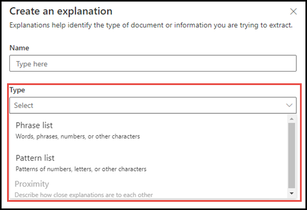

These explanation types are available:

- [**Phrase list**](#phrase-list): List of words, phrases, numbers, or other characters you can use in the document or information that you're extracting. For example, the text string *referring doctor* is in all Medical Referral documents you're identifying. Or the *phone number* of the referring doctor from all Medical Referral documents that you're identifying.

- [**Regular expression**](#regular-expression): Uses a pattern-matching notation to find specific character patterns. For example, you can use a regular expression to find all instances of an *email address* pattern in a set of documents.

- [**Proximity**](#proximity): Describes how close explanations are to each other. For example, a *street number* phrase list goes right before the *street name* phrase list, with no tokens in between (you learn about tokens later in this article). Using the proximity type requires you to have at least two explanations in your model or the option will be disabled.

## Phrase list

A phrase list explanation type is typically used to identify and classify a document through your model. As described in the *referring doctor* label example, it's a string of words, phrases, numbers, or characters that is consistently in the documents that you're identifying.

While not a requirement, you can achieve better success with your explanation if the phrase you're capturing is located in a consistent location in your document. For example, the *referring doctor* label might be consistently located in the first paragraph of the document. You can also use the **[Configure where phrases occur in the document](explanation-types-overview.md#configure-where-phrases-occur-in-the-document)** advanced setting to select specific areas where the phrase is located, especially if there's a chance that the phrase might occur in multiple locations in your document.

If case sensitivity is a requirement in identifying your label, using the phrase list type allows you to specify it in your explanation by selecting the **Only exact capitalization** checkbox.

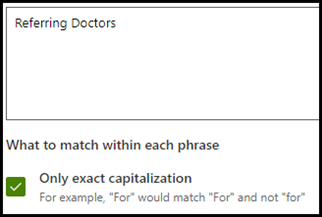

A phrase type is especially useful when you create an explanation that identifies and extracts information in different formats, such as dates, phone numbers, and credit card numbers. For example, a date can be displayed in many different formats (1/1/2020, 1-1-2020, 01/01/20, 01/01/2020, or Jan 1,2020). Defining a phrase list makes your explanation more efficient by capturing any possible variations in the data that you're trying to identify and extract.

For the *phone number* example, you extract the phone number for each referring doctor from all Medical Referral documents that the model identifies. When you create the explanation, type the different formats a phone number might display in your document so that you're able to capture possible variations.

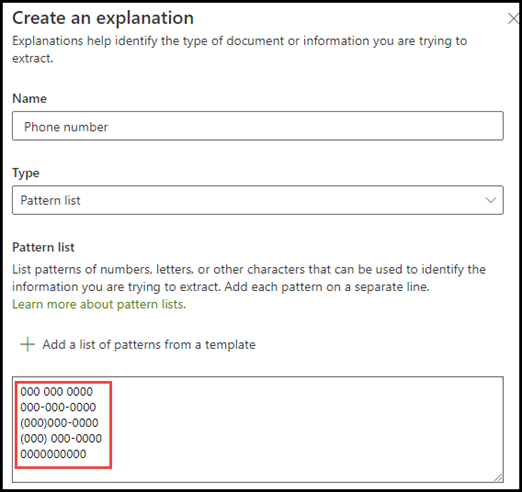

For this example, in **Advanced Settings** select the **Any digit from 0-9** checkbox to recognize each "0" value used in your phrase list to be any digit from 0 through 9.

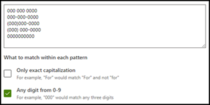

Similarly, if you create a phrase list that includes text characters, select the **Any letter from a-z** checkbox to recognize each "a" character used in the phrase list to be any character from "a" to "z".

For example, if you create a **Date** phrase list and you want to make sure that a date format such as *Jan 1, 2020* is recognized, you need to:

- Add *aaa 0, 0000* and *aaa 00, 0000* to your phrase list.
- Make sure that **Any letter from a-z** is also selected.

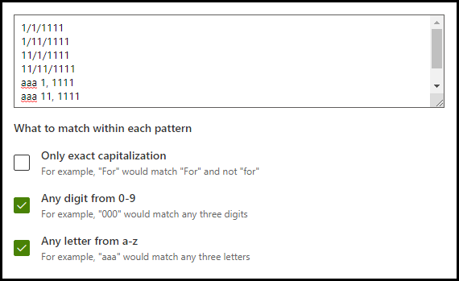

If you have capitalization requirements in your phrase list, you can select the **Only exact capitalization** checkbox. For the date example, if you require the first letter of the month to be capitalized, you need to:

- Add *Aaa 0, 0000* and *Aaa 00, 0000* to your phrase list.
- Make sure that **Only exact capitalization** is also selected.

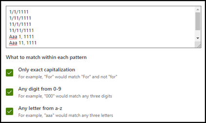

> [!NOTE]
> Instead of manually creating a phrase list explanation, use the [explanation library](explanation-templates.md) to use phrase list templates for a common phrase list, such as *date*, *phone number*, or *credit card number*.

## Regular expression

A regular expression explanation type allows you to create patterns that help find and identify certain text strings in documents. You can use regular expressions to quickly parse large amounts of text to:

- Find specific character patterns.
- Validate text to ensure that it matches a predefined pattern (such as an email address).
- Extract, edit, replace, or delete text substrings.

A regular expression type is especially useful when you create an explanation that identifies and extracts information in similar formats, such as email addresses, bank account numbers, or URLs. For example, an email address, such as megan@contoso.com, is displayed in a certain pattern ("megan" is the first part, and "com" is the last part).

The regular expression for an email address is: **[A-Za-z0-9._%-]+@[A-Za-z0-9.-]+.[A-Za-z]{2,6}**.

This expression consists of five parts, in this order:

1. Any amount of the following characters:

   a. Letters from a to z

   b. Numbers from 0-9

   c. Period, underscore, percent, or dash

2. The @ symbol

3. Any amount of the same characters as the first part of the email address

4. A period

5. Two to six letters

To add a regular expression explanation type:

1. From the **Create an explanation** panel, under **Explanation type**, select **Regular expression**.

   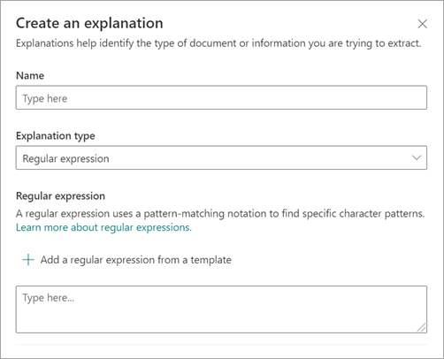

2. You can either type an expression in the **Regular expression** text box or select **Add a regular expression from a template**.

   When you add a regular expression by using a template, it automatically adds the name and the regular expression to the text box. For example, if you choose the **Email address** template, the **Create an explanation** panel is populated.

   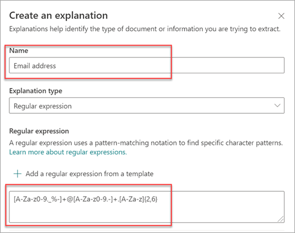

### Limitations

The following table shows inline character options that currently aren't available for use in regular expression patterns.

|Option|State|Current functionality|
|---|---|---|
|Case sensitivity|Currently not supported.|All matches performed are case-insensitive.|
|Line anchors|Currently not supported.| Unable to specify a specific position in a string where a match must occur.|

## Proximity

The proximity explanation type helps your model identify data by defining how close another piece of data is to it. For example, in your model say you have defined two explanations that label both the customer *street address number* and *phone number*.

Notice that customer phone numbers always appear before the street address number.

Alex Wilburn 
555-555-5555 
One Microsoft Way 
Redmond, WA 98034 

Use the proximity explanation to define how far away the phone number explanation is to better identify the street address number in your documents.

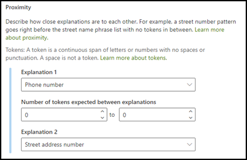

> [!NOTE]
> Regular expressions currently can't be used with the proximity explanation type.

#### What are tokens?

To use the proximity explanation type, you need to understand what a token is. The number of tokens is how the proximity explanation measures distance from one explanation to another. A token is a continuous span (not including spaces or punctuation) of letters and numbers.

The following table shows examples for how to determine the number of tokens in a phrase.

|Phrase|Number of tokens|Explanation|
|---|---|---|
|`Dog`|1|A single word with no punctuation or spaces.|
|`RMT33W`|1|A record locator number. It might include numbers and letters, but doesn't have punctuation.|
|`425-555-5555`|5|A phone number. Each punctuation mark is a single token, so `425-555-5555` is 5 tokens: `425` `-` `555` `-` `5555`|
|`https://luis.ai`|7|`https` `:` `/` `/` `luis` `.` `ai`|

#### Configure the proximity explanation type

For the example, configure the proximity setting to define the range of the number of tokens in the *phone number* explanation from the *street address number* explanation. Notice that the minimum range is "0", because there are no tokens between the phone number and street address number.

But some phone numbers in the sample documents are appended with *(mobile)*.

Nestor Wilke 
111-111-1111 (mobile) 
One Microsoft Way 
Redmond, WA 98034 

There are three tokens in *(mobile)*:

|Phrase|Token count|
|--|--|
|(|1|
|mobile|2|
|)|3|

Configure the proximity setting to have a range of 0 through 3.

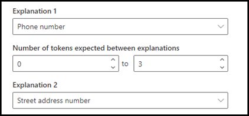

## Configure where phrases occur in the document

When you create an explanation, by default the entire document is searched for the phrase you're trying to extract. However, you can use the **Where these phrases occur** advanced setting to help in isolating a specific location in the document that a phrase occurs. This setting is useful in situations where similar instances of a phrase might appear somewhere else in the document, and you want to make sure that the correct one is selected.

Referring to our Medical Referral document example, the *referring doctor* is always mentioned in the first paragraph of the document. With the **Where these phrases occur** setting, in this example you can configure your explanation to search for this label only in the beginning section of the document, or any other location in which it might occur.

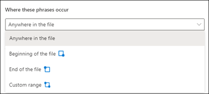

You can choose the following options for this setting:

- Anywhere in the file: The entire document is searched for the phrase.

- Beginning of the file:  The document is searched from the beginning to the phrase location.

   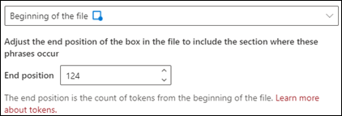

    In the viewer, you can manually adjust the select box to include the location where the phase occurs. The **End position** value updates to show the number of tokens your selected area includes. You can update the **End position** value as well to adjust the selected area.

   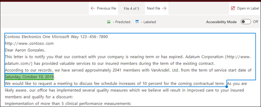

- End of the file: The document is searched from the end to the phrase location.

   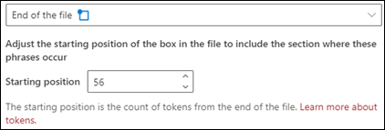

    In the viewer, you can manually adjust the select box to include the location where the phase occurs. The **Starting position** value updates to show the number of tokens your selected area includes. You can update the Starting position value as well to adjust the selected area.

   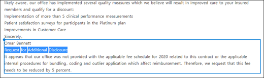

- Custom range: The document is searched within a specified range for the phrase location.

   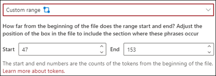

    In the viewer, you can manually adjust the select box to include the location where the phase occurs. For this setting, you need to select a **Start** and an **End** position. These values represent the number of tokens from the beginning of the document. While you can manually enter in these values, it's easier to manually adjust the select box in the viewer.

## Considerations when configuring explanations

When training a classifier, there a few things to keep in mind that will produce more predictable results:

- The more documents you train with, the more accurate the classifier will be.  When possible, use more than five good documents and use more than one bad document. If the libraries you're working with have several different document types in it, several of each type lead to more predictable results.
- Labeling the document plays an important role in the training process. They're used together with explanations to train the model. You might see some anomalies when training a classifier with documents that don't have much content in them. The explanation might not match anything in the document but since it was labeled as a "good" document you may see it be a match during training.
- When creating explanations, it uses OR logic in combination with the label to determine if it's a match. Regular expression that uses AND logic might be more predictable. Here's a sample regular expression to use on real documents as your training them. Note the text highlighted in red is the phrase or phrases you would be looking for.

    <pre>(?=.*network provider)(?=.*participating providers).*</pre>

- Labels and explanations work together and are used in training the model.  It's not a series of rules that can be de-coupled and precise weights or prediction applied to each variable that has been configured.  The greater the variation of documents used in the training will provide more accuracy in the model.

### See also

[Use explanation templates in Microsoft Syntex](explanation-templates.md)
