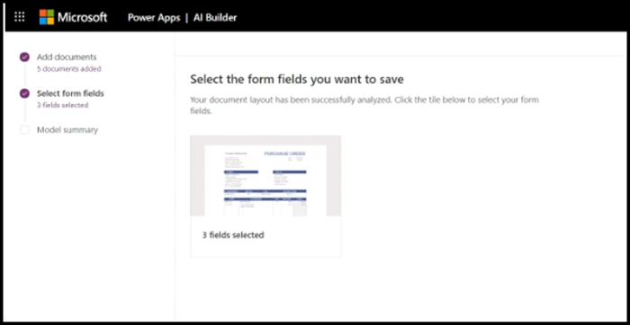
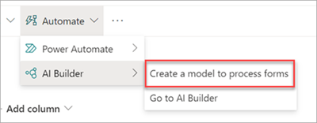

# Overview of structured and freeform document processing in Microsoft Syntex

 

> [!VIDEO https://www.microsoft.com/videoplayer/embed/RW15YNo]

 

Use the structured document processing model ([layout method](create-syntex-model.md#train-a-custom-model)) to automatically identify field and table values. It works best for structured or semi-structured documents, such as forms and invoices.

Use the freeform document processing model ([freeform selection method](create-syntex-model.md#train-a-custom-model)) to automatically extract information from unstructured and freeform documents, such as letters and contracts.

## Introduction to structured and freeform models

Microsoft Syntex uses Microsoft Power Apps [AI Builder](/ai-builder/form-processing-model-overview) document processing (formerly known as form processing) to create structured and freeform document processing models within SharePoint document libraries.
<!---
 
--->
You can use AI Builder document processing to create structured or freeform document processing models that use machine learning technology to identify and extract key-value pairs and table data from structured or semi-structured documents, such as forms and invoices, and unstructured or freeform documents, such as contracts and correspondence.

Organizations often receive invoices in large quantities from various sources, such as mail, fax, and email. Processing these documents and manually entering them into a database can take a considerable amount of time. By using AI to extract the text, key-value pairs, and tables from your documents, Syntex automates this process.

> [!NOTE]
> For more ideas about how to use these models in your organization, see [Get started driving adoption](adoption-getstarted.md) and [Scenarios and use cases](adoption-scenarios.md).

For example, you can create a structured or freeform document processing model that identifies all documents that are uploaded to the document library. From each document, you can then extract and display specific data that is important to you.

  

You use example files to train your model and define the information to be extracted from your form. The layout of your document is learned by training your model. You only need five form documents to get started. Syntex will analyze your example files for key-value pairs, and you can also manually identify ones that might not have been detected.  AI builder lets you test the accuracy of your model on your example files.

You can only create a structured or freeform document processing model in SharePoint document libraries for which it's enabled. If it has been enabled, you're able to see the **Classify and extract** option in your document library. 

If you need it enabled on your document library, contact your Microsoft 365 admin.

## Requirements and limitations

For information about requirements to consider when choosing this model, see [Requirements and limitations for models in Microsoft Syntex](requirements-and-limitations.md#structured-document-processing).

