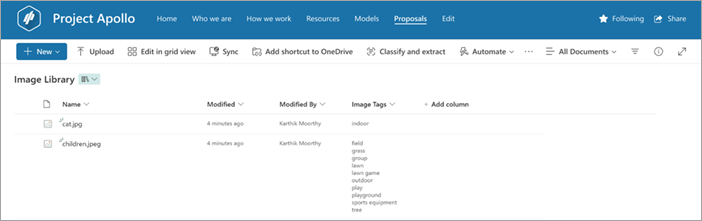

# Overview of image tagging in Microsoft Syntex

Microsoft Syntex makes it easier to find and manage images in SharePoint document libraries. It does this process by automatically tagging images with descriptive keywords using AI. These keywords are stored in a managed metadata column (the **Image Tags** column), which makes it easier to search, sort, filter, and manage the images.

  

The image tagging feature makes it even easier to tag images without any training, thereby reducing the need for manual tagging or custom AI model building. This result means you can quickly find images in your libraries and set up processes based on the tags for the images.

## Requirements and limitations

### Supported file types

Image tagging is available for the following image file types: .bmp, .png, .gif, .jpeg, .jpg, .tif, .tiff, .ari, .arw, .bay, .cap, .crw, .cr2, .cr3, .dcr, .dcs, .dng, .drf, .eip, .erf, .fff, .heic, .heif, .iiq, .kdc, .k25, .mef, .mos, .mrw, .nef, .nrw, .orf, .pef, .ptx, .pxn, .raf, .raw, .rwl, .rw2, .sr2, .srf, .srw, .x3f, and .3fr.

### Current release notes

- **Time taken to reflect tags getting in the **Image Tags** column:** Minimum: 5 minutes, maximum: 24 hours.

- **Image Tags is an editable taxonomy column:**  You can add new tags or remove the AI-generated tags as needed to meet your requirements.

- **Custom metadata already applied:** If the image already has custom metadata applied to it, that information is extracted and shown in the **Image Tags** column.

- **Existing image processing:** Currently, existing images aren't processed when image tagger is enabled. Any newly uploaded images are processed for automatic image tagging.

- **Responsible AI guidelines:** Send us feedback on the image tagging quality. We monitor feedback closely and take appropriate action based on the feedback.

<!---
# Set up image tagging in Microsoft Syntex

(Coming soon)

With image tagging in Microsoft Syntex, users can find images through search by searching on image tags, and create workflows based on image tags. By default, basic image tagging is turned on for SharePoint and OneDrive. Images uploaded to either location are automatically scanned and applicable tags are applied, if available, from a list of 37 basic tags. Users can find images through search by searching on the image tags.

When a user uploads an image, the  tagging process runs automatically. If an image is edited, the tagging process runs again to update the tags.

Users with permissions to the image file can see and edit the tags in the file information panel or in the search results page. Once a user edits an image's tags, the system no longer auto-tags that image, even if it's edited.

If you turn tagging off, images will no longer be automatically tagged. Existing tags won't be removed.

> [!NOTE]
> System generated tags may change with updates to the image or our tag technology.

## Configure image tagging

After you [set up Syntex](set-up-content-understanding.md), you can configure image tagging in the Microsoft 365 admin center.

To turn image tagging on or off

1. In the Microsoft 365 admin center, select <a href="https://go.microsoft.com/fwlink/p/?linkid=2171997" target="_blank">**Setup**</a>.

2. Under **Organizational knowledge**, click **Automate content understanding**.

3. Click **Manage**.

4. On the **Image tagging** tab, click **Edit**.

5. Choose to allow **Basic tagging** or turn tagging **Off**.

6. Click **Save**.

    
--->
