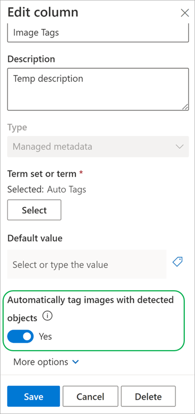
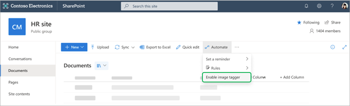
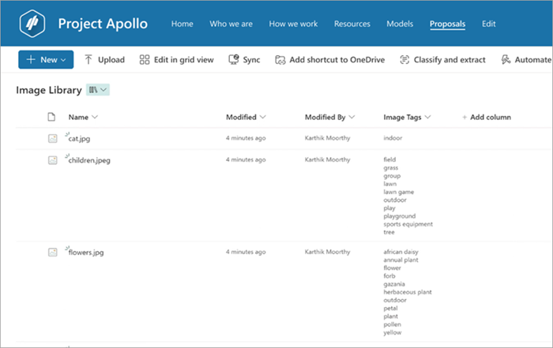

# Find and manage images using image tagging in Microsoft Syntex

Before you can use image tagging, you need to enable it in a document library. There are two methods you can use to do this:

- [Use an existing **Image Tags** column](#use-an-existing-image-tags-column)
- [Enable the **Image Tags** column](#enable-the-image-tags-column)

## Use an existing Image Tags column

If you already have an [**Image Tags** column in your library](https://support.microsoft.com/office/work-with-image-tags-in-a-sharepoint-library), use these steps to enable enhanced image tagging:

1. On the **Image Tags** column, select **Column settings** > **Edit**. 

2. On the **Edit column** panel, in the **Automatically tag images with detected objects** section, toggle the switch to **Yes**.

     
 
3. Once enabled, any new images uploaded to the library are tagged with the descriptive keywords.

## Enable the Image Tags column

If you don't have an **Image Tags** column in your library, use these steps to enable enhanced image tagging:

1. From the document library, select **Automate** > **Enable image tagger**.

    

2. Enhanced image tagging is then activated. Images uploaded are tagged with a set of descriptive keywords. The keywords are available in the **Image Tags** column that is added to the library view.

     

3. Once the **Image Tags** column is configured, you can upload images. The relevant tags are displayed in the library for each image.

<!---
# Set up image tagging in Microsoft Syntex

(Coming soon)

With image tagging in Microsoft Syntex, users can find images through search by searching on image tags, and create workflows based on image tags. By default, basic image tagging is turned on for SharePoint and OneDrive. Images uploaded to either location are automatically scanned and applicable tags are applied, if available, from a list of 37 basic tags. Users can find images through search by searching on the image tags.

When a user uploads an image, the  tagging process runs automatically. If an image is edited, the tagging process runs again to update the tags.

Users with permissions to the image file can see and edit the tags in the file information panel or in the search results page. Once a user edits an image's tags, the system no longer auto-tags that image, even if it's edited.

If you turn tagging off, images will no longer be automatically tagged. Existing tags won't be removed.

> [!NOTE]
> System generated tags may change with updates to the image or our tag technology.

## Configure image tagging

After you [set up Syntex](set-up-content-understanding.md), you can configure image tagging in the Microsoft 365 admin center.

To turn image tagging on or off

1. In the Microsoft 365 admin center, select <a href="https://go.microsoft.com/fwlink/p/?linkid=2171997" target="_blank">**Setup**</a>.

2. Under **Organizational knowledge**, click **Automate content understanding**.

3. Click **Manage**.

4. On the **Image tagging** tab, click **Edit**.

5. Choose to allow **Basic tagging** or turn tagging **Off**.

6. Click **Save**.

    
--->
