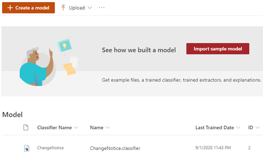
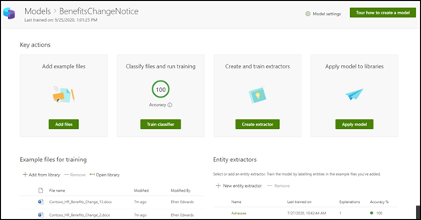

# Import a sample model for Microsoft Syntex

**Applies to:**  &ensp; &#10003; Unstructured document processing 

Microsoft Syntex provides you with a sample unstructured document processing model you can use to examine, giving you a better understanding of how to create your own models. The sample model also allows you to examine model components, such as its classifier, extractors, and explanations. You can also use the sample files to train the model.

## Import the sample model

To access the sample model, you need to first import the model to your content center.

1. From the content center, select **Models** to see your models list.

2. On the **Models** page, select **Import sample model**.

     

3. When the import completes, the **BenefitsChangeNotice** model home page will open. If you need to open the sample model in the future, you can open it from the models list in the content center.

    

Not only can you look through analyze the sample model to get a better understanding of how the model is constructed, but as a working model you can go further and do things such as:

- Add another extractor. For example, add one that extracts the *discount fee*.

- Apply the model to a document library, and upload some of the training files to it to see how the model classifies files and extracts data from them.

## Get sample models

You can access the [Syntex Samples repository](https://github.com/pnp/syntex-samples), which contains community samples that demonstrate different usage patterns of unstructured document processing models. The samples in this repository contain both the model files and the files used to train the model. Once imported, you can use these models to process files and to view and edit the classifier and extractors.
