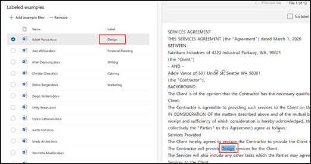
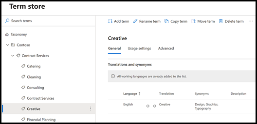
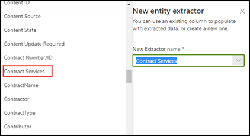
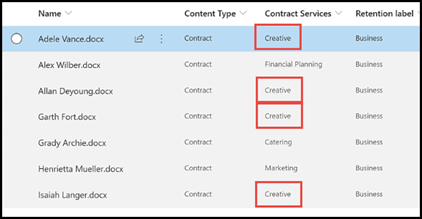

# Leverage term store taxonomy when creating an extractor in Microsoft Syntex

**Applies to:**  &ensp; &#10003; Unstructured document processing 

 

> [!VIDEO https://www.microsoft.com/videoplayer/embed/RE4GpJJ]  

 

When you create an extractor in your unstructured document processing model using Microsoft Syntex, you can take advantage of global term sets in the [term store](/sharepoint/managed-metadata) to display preferred terms for data that you extract.  

As an example, your model identifies and classifies all **Contract** documents that are uploaded to the document library.  Additionally, the model also extracts a **Contract Service** value from each contract, and will display it in a column in your library view. Among the various Contract Services values in the contracts, there are several older values that your company no longer uses and have been renamed. For example, all references to the terms *Design*, *Graphics*, or *Topography* contract services should now be called *Creative*. Whenever your model extracts one of the outdated terms from a contract document, you want it to display the current term—*Creative*—in your library view. In the following example, while training the model we see that one sample document contains the outdated term of *Design*.

    

## Use a managed metadata column in your extractor

Term sets are configured in the Managed Metadata services (MMS) term store in the <a href="https://go.microsoft.com/fwlink/?linkid=2185219" target="_blank">SharePoint admin center</a>. In the example below, the *Contract Services* [term set](/sharepoint/managed-metadata#term-set) is configured to include several terms, including *Creative*.  The details for it show that the term has three synonyms (*Design*, *Graphics*, and *Topography*) and the synonyms should be translated to *Creative*. 

    

There could be many reasons why you might want to use a synonym in your term set. For example, there could be outdated terms, renamed terms, or variations between your organizations departments on naming.

To make the managed metadata field available to select when you create your extractor in your model, you need to [add it as a managed-metadata site column](https://support.microsoft.com/office/8fad9e35-a618-4400-b3c7-46f02785d27f). After you add the site column, you can select it when you create the extractor for your model.

    

After applying your model to the document library, when documents are uploaded to library, the *Creative Services* column will display the preferred term (*Creative*) when the extractor finds any of the synonym values (*Design*, *Graphics*, and *Topography*).

    

> [!NOTE]
> If the term set is open, then any extracted values that do not match a preferred term or synonym value will be added as a new term to the root of the term set. These new terms can be moved, merged, or made synonyms in the term store where the term set resides.

## See also

[Introduction to managed metadata](/sharepoint/managed-metadata#terms)

[Create an extractor](create-an-extractor.md)

[Create a managed metadata column](https://support.microsoft.com/office/create-a-managed-metadata-column-8fad9e35-a618-4400-b3c7-46f02785d27f?redirectSourcePath=%252farticle%252fc2a06717-8105-4aea-890d-3082853ab7b7&ui=en-US&rs=en-US&ad=US)
