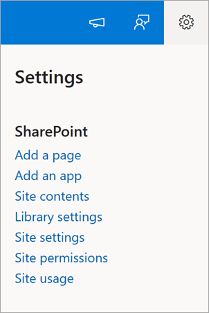
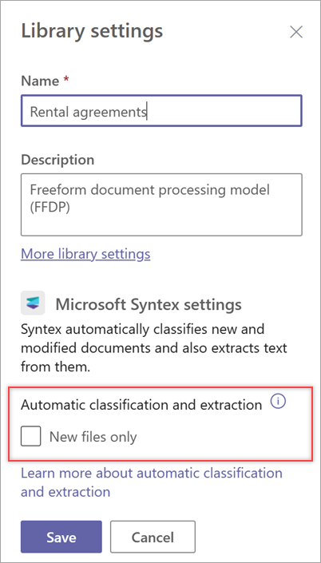

# Manage library settings in Microsoft Syntex

**Applies to:**  &ensp; &#10003; All custom models &ensp; | &ensp; &#10003; All prebuilt models

In Microsoft Syntex, library settings in a SharePoint document library let you see information about the model and also let you configure specific Syntex settings for the library.

To access library settings from a SharePoint document library, select **Settings**  > **Library settings**.

## Automatic classification and extraction

When you apply a model to a library, Syntex automatically adds the content type and updates the default view with the labels you extracted showing as columns. Then, every time you add or edit a document in the library, Syntex processes the document again, classifying the document and extracting text from it.

By default, Syntex processes a file every time the file is uploaded or edited. If you want Syntex to process new files only and not every time a file is modified, you can change the setting.

### To process new files only

Follow these steps if you want Syntex to process new files only.

1. On the **Library settings** panel, under **Automatic classification and extraction**, select **New files only**.

    

2. Select **Save**. Syntex will now automatically process new files only.

   Even with this setting selected, you can still select updated files and manually process them using the **Classify and extract** option in the document library.