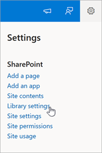

# Manage library settings in Microsoft Syntex

**Applies to:**  &ensp; &#10003; All custom models &ensp; | &ensp; &#10003; All prebuilt models

When you apply a model to a library, Syntex adds the associated content type, the columns, and the view.

By default, Syntex processes a file every time the file is uploaded or edited. If you want Syntex to process only new files, follow these steps.

## Process new files only

1. From a SharePoint document library, select **Settings** > **Library settings**.

    

2. On the **Library settings** panel, in the **Automatic classification and extraction** section, select **New files only**, and then select **Save**.

    