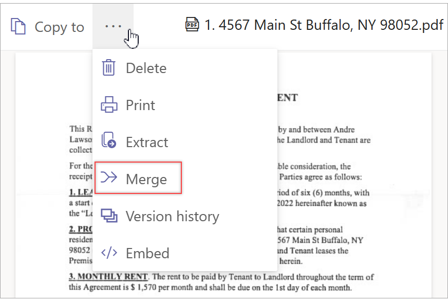
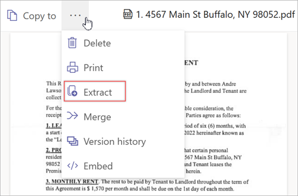

# Merge and extract PDF files in Microsoft Syntex

With Microsoft Syntex, you can merge two or more PDF files into a new PDF file, or you can extract pages from a PDF file to make new individual PDF files.

The **Merge** option lets you quickly combine PDF files into a new PDF file stored in SharePoint or OneDrive. You can easily organize, share, and send multiple PDF files as a single file, allowing you to better organize the information you want to view or share with others.

The **Extract** option lets you divide a PDF file into multiple PDF files. You can quickly share individual pages from a larger PDF file into multiple smaller files that let you tailor the information you want to view or share with others.

> [!NOTE]
> This feature is available for users who have Syntex [per-user](set-up-content-understanding.md) or [pay-as-you-go](syntex-azure-billing.md) licensing.

## Merge PDF files

To merge PDF files, follow these steps:

1. In a SharePoint document library or OneDrive, open one of the PDF files you want to combine.

2. At the top left of the screen, select **More options** (**…**), and then select **Merge**.

    

3. Select the files you want to combine, select **Next**, and then save the merged file to the document library you want it saved in.

## Extract PDF files

To split a PDF file into smaller files, follow these steps:  

1. In a SharePoint document library or OneDrive, open the PDF file you want to split.

2. At the top left of the screen, select **More options** (**…**), and then select **Extract**.

    

3. Select the page you want to extract, and then select **Extract**.
