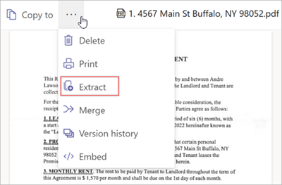

# Merge and extract PDF files in Microsoft Syntex

With Microsoft Syntex, you can combine two or more PDF files into a new PDF file or you can split PDF pages into new individual PDF files.

The **Merge** feature lets you quickly combine PDF files into a new PDF file stored in SharePoint or OneDrive. You can easily organize, share, and sending multiple PDF files. Integrating multiple PDFs into a large PDF file lets users better organize the information they want to view or share with others.

The **Extract** feature lets you divide a PDF file into multiple PDFs, allowing you to quickly split and extract multiple pages of a PDF into a new PDF file. Now, Syntex users won’t have to worry about sharing information they don’t want from a large PDF file. Splitting a large PDF file into multiple, smaller files lets users tailor the information they want to view or share with others.

> [!NOTE]
> These features are available only for licensed Syntex users.

## Merge PDF files

Now, Syntex users won’t have to worry about organizing, sharing, or sending multiple PDF files. Integrating multiple PDFs into a large PDF file lets users better organize the information they want to view or share with others.

To merge PDF files, follow these steps:

1. In a SharePoint document library or OneDrive, open one of the PDF files you want to combine.

2. At the top left of the screen, select **More options** (**…**), and then select **Merge**.

    

3. Select the files you want to combine, select **Next**, and then save the merged file to the document library you want it saved in.

## Extract PDF files

To split a PDF file, follow these steps:  

1. In a SharePoint document library or OneDrive, open the PDF file you want to split.

2. At the top left of the screen, select **More options** (**…**), and then select **Extract**.

    

3. Select the page you want to extract, and then select **Extract**.
