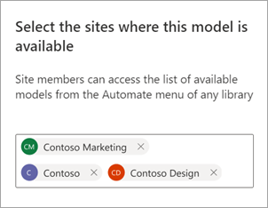

# Share an enterprise model in Microsoft Syntex

**Applies to:**  &ensp; &#10003; All custom models &ensp; | &ensp; &#10003; All prebuilt models

You can make your trained enterprise models available for others to view and use directly from a SharePoint document library. Enterprise models are created and trained in the [content center](create-a-content-center.md). 

## Share your model with others

To make your trained model available for others to use:

1. On the **Models** page for your model, select **Model settings**.

2. On the **Model settings** panel, in the **Sites where this model is available** section, select **Edit**.

3. At this point, the **Select the sites where this model is available** panel will be different depending on whether or not you're an administrator. 

    If you're a SharePoint administrator, you'll see this view.

    

    - **Not available on any sites** – The model won't be available for others to use.
    - **All sites** – The model will be available in the content type gallery for others to use.
    - **Only selected sites** – You can choose which site or sites in which the model will be available. Use the text box to search for and choose the sites to which you want the model applied. You'll only see sites for which you have access.

    If you *aren't* a SharePoint administrator, you'll see this view.

    

    You can only add or remove availability to the specific sites to which you already have access.

4. Select the sites where you want the model to be available for other users to apply, and then select **Save**.

