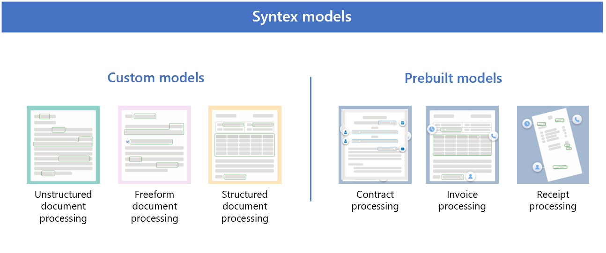
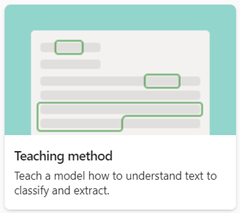
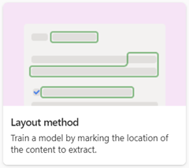
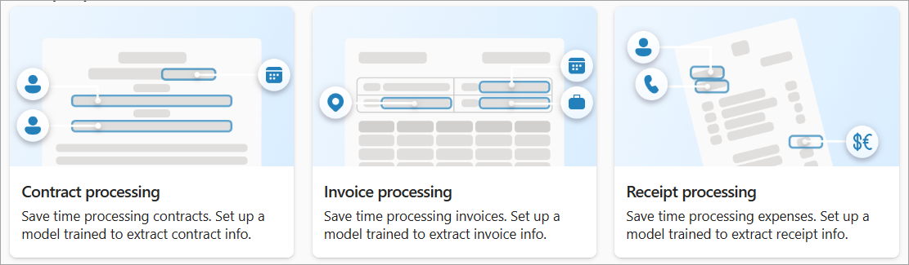

# Overview of model types in Microsoft Syntex

**Applies to:**  &ensp; &#10003; All custom models &ensp; | &ensp; &#10003; All prebuilt models

 

> [!VIDEO https://www.microsoft.com/videoplayer/embed/RE4GJXS] 

 

Content understanding in Microsoft Syntex starts with document processing models. Document processing models let you identify and classify documents that are uploaded to SharePoint document libraries, and then to extract the information you need from each file.

When applied to a SharePoint document library, the model is associated with a content type and has columns to store the information being extracted. The content type you create is stored in the SharePoint content type gallery. You can also choose to use existing content types to use their schema.

Syntex uses [custom models](#custom-models) and [prebuilt models](#prebuilt-models). 

Models can be either *enterprise models*, which are created in a [content center](create-a-content-center.md), or *local models*, which are created on your [local SharePoint site](create-local-model.md).

## Custom models

The type of custom model you choose will depend on the types of files you use, the format and structure of the files, and where you want to apply the model.

Custom models include:

- [Unstructured document processing](#unstructured-document-processing)
- [Freeform document processing](#freeform-document-processing)
- [Structured document processing](#structured-document-processing)

To view the side-by-side differences in custom models, see [Compare custom models](./difference-between-document-understanding-and-form-processing-model.md).

When you create a custom model, you'll select the training method associated with the model type. For example, if you want to create an unstructured document processing model, on the **Options for model creation** page where you create a model, you'll choose the **Teaching method** option. The following table shows the training method associated with each custom model type.

|Unstructured  document processing  |Freeform  document processing  |Structured  document processing  |
|---------|---------|---------|
|  |  |  |

> [!NOTE]
> To make the **Freeform selection method** and the **Layout method** options available to users, they first must be configured in the Microsoft 365 admin center.

### Unstructured document processing

Use the unstructured document processing model to automatically classify documents and extract information from them. It works best with unstructured documents, such as letters or contracts. These documents must have text that can be identified based on phrases or patterns. The identified text designates both the type of file it is (its classification) and what you'd like to extract (its extractors).

For example, an unstructured document could be a contract renewal letter that can be written in different ways. However, information exists consistently in the body of each contract renewal document, such as the text string "Service start date of" followed by an actual date.

This model type supports the widest range of file types and only works on files using the Latin alphabet (English characters).

When you create an unstructured document processing model, use the **Teaching method** option.

For more information, see [Overview of unstructured document processing](document-understanding-overview.md).

### Freeform document processing

Use the freeform document processing model to automatically extract information from unstructured and freeform documents such as letters and contracts where the information can appear anywhere in the document.

Freeform document processing models use Microsoft Power Apps [AI Builder](/ai-builder/form-processing-model-overview) to create and train models within Syntex. 

> [!NOTE]
> The freeform document processing model is not yet available in some regions. For more information, see [Feature availability by region](/ai-builder/availability-region).

Because your organization receives letters and documents in large quantities from various sources, such as mail, fax, and email. Processing these documents and manually entering them into a database can take a considerable amount of time. By using AI to extract the text and other information from these documents, this model automates this process.

This model type is the best option for English documents in PDF or image files when you don't require automatic classification of the type of document.

When you create a freeform document processing model, use the **Freeform selection method** option.

For more information, see [Overview of structured and freeform document processing](form-processing-overview.md).

### Structured document processing

Use the structured document processing model to automatically identify field and table values. It works best for structured or semi-structured documents, such as forms and invoices.

Structured document processing models use Microsoft Power Apps [AI Builder](/ai-builder/form-processing-model-overview) document processing (formerly known as form processing) to create and train models within Syntex. 

This model type supports the widest range of languages and is trained to understand the layout of your form from example documents, and then learns to look for the data you need to extract from similar locations. Forms usually have a more structured layout where entities are in the same location (for example, a social security number on a tax form).

When you create a structured document processing model, use the **Layout method** option.

For more information, see [Overview of structured and freeform document processing](form-processing-overview.md).

## Prebuilt models

If you don't need to build a custom model, you can use a [prebuilt document processing model](prebuilt-overview.md) that has already been trained for specific structured documents.

Prebuilt models include:

- [Contract processing](#contract-processing)
- [Invoice processing](#invoice-processing)
- [Receipt processing](#receipt-processing)

Prebuilt models are pretrained to recognize documents and the structured information in the documents. Instead of having to create a new custom model from scratch, you can iterate on an existing pretrained model to add specific fields that fit the needs of your organization.

### Contract processing

The contract processing model analyzes and extracts key information from contract documents. The API analyzes contracts in various formats and extracts key contract information such as client or party name, billing address, jurisdiction, and expiration date.

For more information about prebuilt contract processing models, see [Use a prebuilt model to extract information from contracts](prebuilt-model-contract.md).

### Invoice processing

The invoice processing model analyzes and extracts key information from sales invoices. The API analyzes invoices in various formats and extracts key invoice information such as customer name, billing address, due date, and amount due.

For more information about prebuilt invoice processing models, see [Use a prebuilt model to extract information from invoices](prebuilt-model-invoice.md).

### Receipt processing

The prebuilt receipt processing model analyzes and extracts key information from sales receipts. The API analyzes printed and handwritten receipts and extracts key receipt information such as merchant name, merchant phone number, transaction date, tax, and transaction total.

For more information about prebuilt receipt processing models, see [Use a prebuilt model to extract information from receipts](prebuilt-model-receipt.md).

