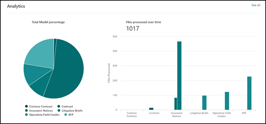
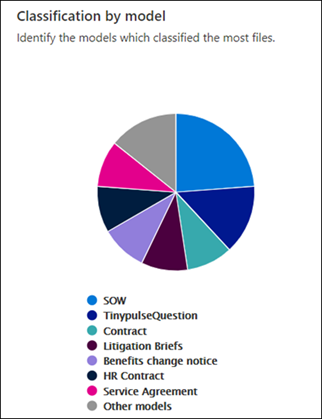
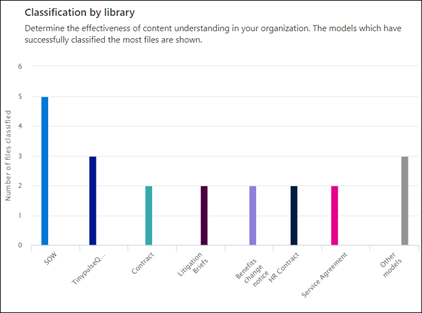

# Analyze how your models are used in Microsoft Syntex

**Applies to:**  &ensp; &#10003; All custom models &ensp; | &ensp; &#10003; All prebuilt models

 

> [!VIDEO https://www.microsoft.com/videoplayer/embed/RE4GnhX]  

 

Your content center in Microsoft Syntex provides you model usage analytics to provide more information about how your models that have been published from the content center are being used. The **How your models are performing in the last 30 days** section of the content center includes a 30 day roll-up of usage analytics data provided in the following charts and lists:

- Classification by model
- Classification by library
- Model usage 

  

### Roll up of model usage data in the default content center

In Syntex, the default content center is created during setup. More content centers can also be created as needed. For example, departments might create their own content centers to create and manage their models. 

Regarding model usage analytics, note that:

- Your default content center will show model usage analytics for all content centers and models in your organization, including ones created in other content centers. This gives content managers and other stakeholders a centralized portal to manage and oversee the content centers and models across the company.
 
- Other content centers will only show model usage analytics for the models that were created in them. This gives content managers insights into usage data for only the models they're concerned with.

## Classification by model

    

The **Classification by model** pie chart displays which models have classified the most files. It shows each published model as a percentage of the total files processed by all published models on the content center.

Each model also shows the **Completeness Rate**, the percentage of uploaded files that were successfully analyzed by the model. A low completeness rate may mean that there are issues with either the model or the files that are being analyzed.

## Classification by library

    

The **Classification by library** bar chart helps you determine the effectiveness of content understanding in your organization. It shows you not only the number of files processed over time for each model, but by selecting a column in chart, it will also show you the document libraries to which the model was applied.

## Model usage

The model usage list shows usage analytics for the models created through the content center.  

> [!NOTE]
> If you are in the default content center and have additional content centers in your organization, the model usage list will be grouped by content center.

Each model in the model usage list will show the usage data:

- Classified item count: Number of files processed by the model.
- Average confidence score: Average accuracy score of the model when run against files.
- Target list URL: The SharePoint document library to which the model is applied.
