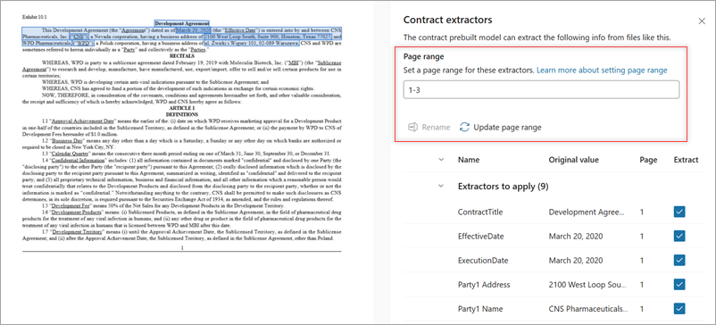
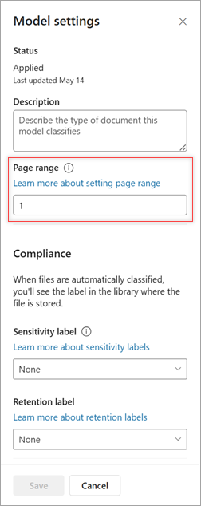

# Set a page range to extract information from specific pages in Microsoft Syntex

**Applies to:**  &ensp; &#10003; Structured and freeform models &ensp; | &ensp; &#10003; Contracts, Invoices, and Receipts prebuilt models

You can set a page range to specify which pages in a document you want to extract information from when using a document processing model. This setting can be used to process a range of pages for files rather than the entire file. Processing fewer pages can lead to cost savings, because model services are billed based on the number of pages processed. It can also be more efficient by reducing processing time.

> [!NOTE]
> By default, the page range setting is empty. If no page range is provided, the entire document will be processed.

<!---
> [!NOTE]
> This setting is not available for unstructured document processing models or sensitive information prebuilt models.
--->

## Set a page range when you train a prebuilt model

When you select extractors for a prebuilt contracts, invoices, or receipts model, you can specify the pages from which you want to extract the information.

1. On the **Extractors** panel, in the **Page range** section, enter the page or range of pages you want to process. For help in understanding format options, see [Tips for setting a page range](#tips-for-setting-a-page-range).

    

2. The **Page** column on the **Extractors** panel shows the page that an extractor is on. To try other page ranges, enter a page range in the box, and then select **Update page range** to refresh the **Page** column.

<!---().--->

3. Continue selecting distractors and then apply the model as usual.

## Set or update a page range on an existing model

For structured and freeform models, and for prebuilt contracts, invoices, and receipts models, you can specify a page range or modify a page range of an existing of a model that has already been trained.

1. On the model home page, select **Model settings**.

2. On the **Model settings** panel, in the **Page range** section, enter the page range of the pages you want to process. For help in understanding format options, see [Tips for setting a page range](#tips-for-setting-a-page-range).

    

3. Select **Save**.

    > [!IMPORTANT]
    > When you save a new page range from the **Model settings** panel, the files in libraries where the model is applied are reprocessed.

## Tips for setting a page range

The following table shows format options for setting a page range.

|Page range  |Example range  |Result  |
|---------|---------|---------|
|Single pages    | 1, 5, 9        | Pages 1, 5, and 9 will be processed.  |
|Finite ranges     | 2-5       | Pages 2 to 5 will be processed.  |
|Open-ended ranges    | 5-      | All pages from page 5 to the end of file will be processed.        |

- **Cumulative ranges**: Range options are cumulative and can be combined, even with overlapping segments. For example, specifying “-5, 1, 3, 5-10” results in processing pages 1 through 10.

- **Specified range processing**: Pages falling within the specified range are processed and incur charges. For example, a five-page document with a range of “5-100” will only have page 5 processed.

- **Excluded range non-processing**: Pages outside the designated range are neither processed nor charged. For example, a five-page document with a range of “45, 48-50” will result in no pages being processed.

<!---- 
These range options are cumulative and can be mixed or with overlapping ranges. For example, for the range “-5, 1, 3, 5-10," pages 1 to 10 will be processed.

Pages within the specified range will be processed and charged. For example, for a five-page document with a page setting of "5-100," only page 5 will be processed.

Pages outside the set range won't be processed or charged. For example, a five-page document with a page setting of "45, 48-50" won't have any pages processed.

## See whether a model has a page range set

To see if a model has a range set on it, 

    > [!NOTE]
    > By default, the page range setting is empty. If no page range is provided, the entire document will be processed.

    |Page range  |Example range  |Result  |
    |---------|---------|---------|
    |Single pages    | "1, 5, 9"        | Pages 1, 5, and 9 will be processed.  |
    |Finite ranges     | “2-5”       | Pages 2 to 5 will be processed.  |
    |Open-ended ranges    | "5-"      | All pages from page 5 to the end of file will be processed.        |

    These range options are cumulative and can be mixed or with overlapping ranges. For example, for the range “-5, 1, 3, 5-10," pages 1 to 10 will be processed.

    Pages within the specified range will be processed and charged. For example, for a five-page document with a page setting of "5-100," only page 5 will be processed.

    Pages outside the set range won't be processed or charged. For example, for a five-page document with a page setting of "45, 48-50" won't have any pages processed.
--->