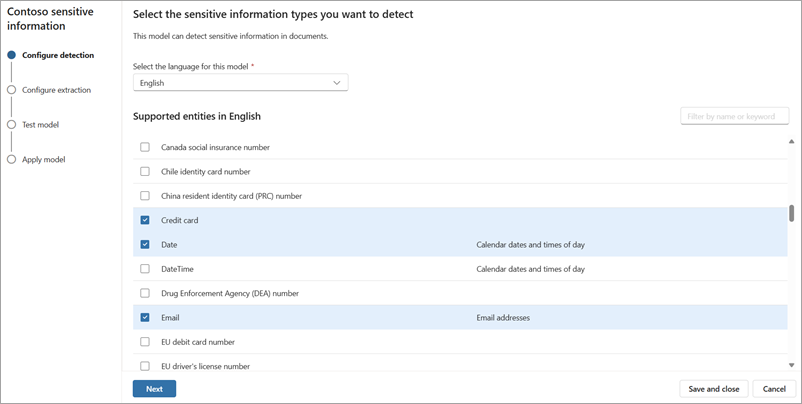

# Use a prebuilt model to detect sensitive information from documents in Microsoft Syntex

The prebuilt *sensitive information model* analyzes and detects key information from documents. The model recognizes documents in various formats and [detects sensitive information](/azure/ai-services/language-service/personally-identifiable-information/concepts/entity-categories#entity-categories), such as personal identification numbers, personal physical and email addresses, phone numbers, and personal financial or health information. This model can also extract key sensitive information when selected.

## Set up a sensitive information model

To create and configure a sensitive information model, follow these steps:

<!---
- Step 1: [Create a sensitive information model](#step-1-create-a-sensitive-information-model)
- Step 2: [Select the information types to detect](#step-2-select-the-information-types-to-detect)
- Step 3: [Configure the information to detect](#step-3-configure-the-information-to-detect)
- Step 4: [Configure the information to extract](#step-4-configure-the-information-to-extract)
- Step 5: [Test the model](#step-5-test-the-model)
- Step 6: [Apply the model](#step-6-apply-the-model)

### Step 1: Create a sensitive information model

--->

1. Follow the instructions in [Create a model in Syntex](create-syntex-model.md#set-up-a-prebuilt-model) to create a prebuilt sensitive information model. Then continue with the following steps to complete your model.

2. On the **Models** page, in the **Add entities to detect** section, select **Add entities**.

    

3. On the **Configure detection** page:

    - Select the language you want to use for this model. Only one language can be selected for each model. This model supports languages for both [handwritten text](/azure/ai-services/computer-vision/language-support#handwritten-text) and [print text](/azure/ai-services/computer-vision/language-support#print-text).

    - Select the sensitive information types you want to detect, and then select **Next**.

    

4. On the **Configure extraction** page, select the sensitive information types you want to extract, and then select **Next**.

    

5. On the **Test model** page, select **+Add files** to select sample files to test your model.

    

6. On the **Apply model** page, select **Finish** to apply the model to detect sensitive information in files.

    

    Entities that are detected are displayed in columns in the document library.

    

For information about file types, languages, optical character recognition, and other considerations for this model, see [Requirements and limitations for models in Microsoft Syntex](requirements-and-limitations.md#prebuilt-models).
<!---
## Create a rule to apply a sensitivity label

To create a rule to automatically apply a sensitivity label or a retention to a document, see [link to article TBD].--->

