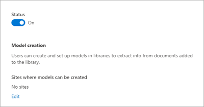

# Set up and manage prebuilt document processing in Microsoft Syntex

The prebuilt document processing service for Microsoft Syntex is set up in the Microsoft 365 admin center.

## Prerequisites

### Licensing

Before you can use prebuilt document processing in Microsoft Syntex, you must first link an Azure subscription in [Microsoft Syntex pay-as-you-go](syntex-azure-billing.md). Prebuilt document processing in Microsoft Syntex is billed based on the [type and number of transactions](syntex-pay-as-you-go-services.md).

### Permissions

You must be a [SharePoint Administrator](/entra/identity/role-based-access-control/permissions-reference#sharepoint-administrator) or [Global Administrator](/entra/identity/role-based-access-control/permissions-reference#global-administrator) to be able to access the Microsoft 365 admin center and set up prebuilt document processing.

[!INCLUDE [global-administrator-note](../includes/global-administrator-note.md)]

## Set up prebuilt document processing

After an [Azure subscription is linked to Microsoft Syntex](syntex-azure-billing.md), prebuilt document processing will be automatically set up and enabled for all SharePoint sites.

## Manage sites

By default, prebuilt document processing is turned on for libraries in all SharePoint sites. When prebuilt document processing is on, prebuilt models are allowed to run. Prebuilt models can also be created and applied on sites that are specified.

Follow these steps to limit on which sites users can create prebuilt models to process files.

1. In the Microsoft 365 admin center, select <a href="https://go.microsoft.com/fwlink/p/?linkid=2171997" target="_blank">**Setup**</a>.

2. Under **Files and content**, select **Automate content processes with Syntex**.

3. On the **Automate content processes with Syntex** page, select **Go to Syntex settings**.

4. On the Syntex page, in the **Document & image services** section, select **Prebuilt document processing**.

5. On the **Prebuilt document processing** panel:

    a. On the **Sites** tab, choose the site or sites on which this service should be enabled.

    > [!NOTE]
    > Disabling a site after a model is made available to process files on that site will not disable the model. Models can still be used to process files and incur charges. A model can be made available to process files by being created on that site or in a content center.

    b. To restrict user access to this service, under **Sites where models can be created**, select **Edit**. On the **Sites where models can be created** panel, select **No sites** or **Selected sites (up to 100)** and follow the instructions to either select the sites or upload a CSV file listing a maximum of 100 sites. You can then manage site access permissions for the sites you selected. If you don't want the service available on any sites, select **No sites**.

    > [!NOTE]
    > You must be a member of any site that you want to include in the CSV file.

    > [!NOTE]
    > For multi-geo environments, the **No sites** and **Selected sites** settings apply only to the primary geo of multi-geo tenants. If you want to restrict or add sites in non-primary geos, contact Microsoft support.

    c. Select **Save**.

## Turn off prebuilt document processing

When the prebuilt document processing service is turned off, prebuilt models won't run, and users won't be able to create or apply prebuilt models.

Follow these steps to turn off prebuilt document processing.

1. On the **Prebuilt document processing** panel, on the **Settings** tab, turn the **Status** to **Off**.

2. On the **Turn off prebuilt document processing?** panel, select **Turn off**.

    > [!NOTE]
    > For multi-geo environments, when the service is turned off, the service is off for all geos.

<!---
    
--->