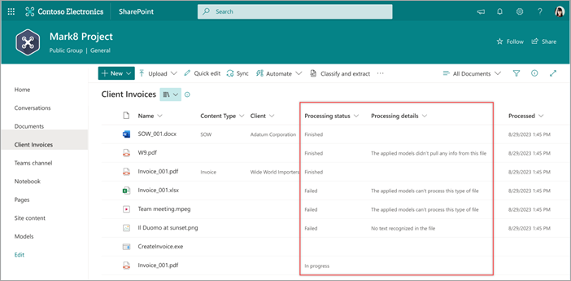

# View the status of a file processed by Microsoft Syntex

**Applies to:**  &ensp; &#10003; All custom models &ensp; | &ensp; &#10003; All prebuilt models

In a document library, you can see the status of any file that is being processed by a model in Microsoft Syntex by looking in the **Processing status** and **Processing details** columns.

The **Processing status** column shows you whether the processing of a file is in progress, completed, or wasn’t done due to an error with the file or the job. The status helps you know whether a file needs to be queued again for processing or if more investigation is required.

| Processing status | Description |
| ------- | -------
| In progress | The file has been queued for processing or is processing. |
| Finished | The file has been processed. |
| Failed | The file has been queued, but can't be processed (for example, the file type isn't supported or there's an issue with an image or text). |

> [!NOTE]
> When a file is uploaded or edited, the **Processing status** column will not change to "In progress." It will remain unchanged until processing completes, and then the status will show as "Finished" or "Failed."

<!---
| Processing status | Description |
| ------- | ------- 
| In progress | File has been queued for processing. |
| Finished | File has been processed. |
| Not supported | File has been queued, but can't be processed (for example, the file type isn't supported). |
| Error | File can't be queued for processing (for example, the file isn't supported at all). |
| [Empty] | No models have been applied to the library. |
--->

The **Processing details** column provides more information about the processing status, such as if a file format isn't supported or if an image is too small.

When a new model is applied to a library, the **Processing status** and the **Processing details** columns are automatically added. However, the columns won't be automatically added to libraries where a model has already been applied. You'll need to apply the model again to add the columns.

> [!NOTE]
> Libraries that run a document understanding model have a column named **Corrected**. The **Corrected** column is set to true when a user has manually changed the content type of a processed file. This excludes the file from future reprocessing.
