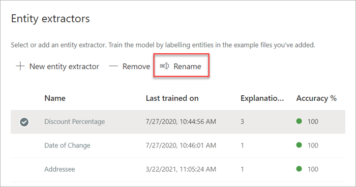
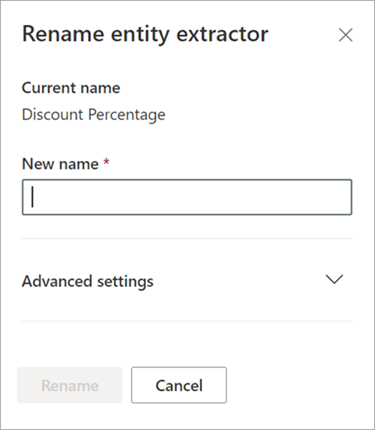

# Rename an extractor in Microsoft Syntex

**Applies to:**  &ensp; &#10003; Unstructured document processing 

At some point, you might need to rename an extractor if you want to refer to an extracted data field by a different name. For example, your organization decides to make changes to their contract documents, and refers to “customers” as “clients” in their documents. If you were extracting a “Customer” field in your model, you can choose to rename it to “Client.”

When you sync your updated model to your SharePoint document library, you'll see a new “Client” column in your document library view. Your view retains the “Customer” column for past activity, but will update the new “Client” column for all new documents that are processed by your model. 

> [!IMPORTANT]
>  Make sure to sync your updated model to the document libraries where you had previously applied it for the new column name to display. 

## Rename an extractor

Follow these steps to rename an entity extractor.

1. From the content center, select **Models** to see your models list.

2. On the **Models** page, in the **Name** column, select the model for which you want to rename an extractor.

3. Under **Entity extractors**, select the name of the extractor you want to rename, and then select **Rename**.

     

4. On the **Rename entity extractor** panel:

   a. Under **New name**, enter the new name of the extractor.

     

   b. (Optional) Under **Advanced settings**, select whether you want to associate an existing site column.

5. Select **Rename**.

