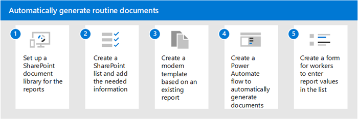

# Scenario: Automatically generate routine documents with Microsoft Syntex

:::row:::
   :::column span="":::      
      Use the content assembly feature in Microsoft Syntex to create modern templates for files that need to be created on a regular basis. Files can then be generated based on these templates, either through manual request or through an automation.

      Features used:
      - Content assembly
      - SharePoint lists
      - Power Automate  
   :::column-end:::
   :::column span="":::
      
   :::column-end:::
:::row-end:::

## Routine maintenance reports

You can use content assembly to automate the generation of daily inspection or maintenance reports. These reports generally have a lot of standardized text with certain fields or values that are entered by the user after inspection.

Today, users physically inspect parts and then fill in a list or a form or physical paper reports. This leads to additional work in transforming this data into digital content that can be used further. 

To implement a Syntex solution:

   

1. Set up a document library where you want to store the reports.  

2. Set up a SharePoint list with the required columns that you need to be filled in by the frontline workers.  

3. Go to the document library and create a modern template using an existing report. Create fields for the values that are entered by the frontline workers and then associate the fields with the columns of the SharePoint list you previously set up.  

4. Now create a Power Automate flow using the action “Generate document using Syntex” and use the trigger “When a list item is created.” This ensures that whenever a new entry is added by a frontline worker to the list, a new report is generated.  

5. Using Microsoft Forms, you can create a form for frontline workers to enter values in the list or expose the list itself for them to add values.  

You can now review all daily reports as they get created based on values that frontline workers enter in the form.  

> [!Note]
> Although this example uses a SharePoint list as a data source, you can use any data source as a trigger for generating documents if you have access to the required Power Automate connector.  

 

> [!div class="nextstepaction"]
> [See more scenarios and use cases for Syntex](adoption-scenarios.md)

