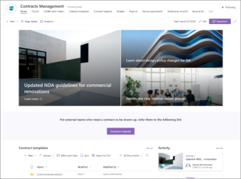
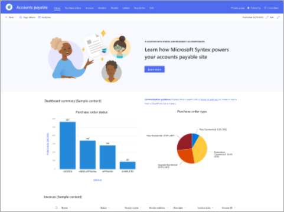
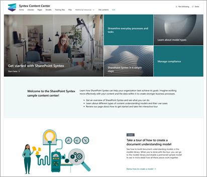

# Site templates for Microsoft Syntex

SharePoint site templates for Microsoft Syntex are prebuilt, ready-to-deploy, and customizable. Use these templates to create a professional site to manage, process, and track the status of business documents in your organization.

|Site template |Description  |
|---------|---------|
|[**Accounts payable**](https://support.microsoft.com/en-us/office/80820115-c700-4a62-bb59-69b33c8e3b4f)     |
|Manage, process, and track purchase orders, invoices, and related files.    - Use Microsoft Syntex to organize and classify files.  - Extract key information from invoices using a prebuilt invoice model.  - Share important information, such as updates to agreements or new policies.  - Store purchase orders and invoices in preconfigured document libraries.  - Generate files efficiently using modern templates.   [Learn more about the accounts payable site template](https://support.microsoft.com/en-us/office/80820115-c700-4a62-bb59-69b33c8e3b4f)      |
|Row2     |         |
|Row3     |         |

|Site template  |Description  |Site capabilites  |
|---------|---------|---------|
|[**Accounts payable**](https://support.microsoft.com/en-us/office/80820115-c700-4a62-bb59-69b33c8e3b4f)    |
|Manage, process, and track purchase orders, invoices, and related files.  [Learn more about the accounts payable site template](https://support.microsoft.com/en-us/office/80820115-c700-4a62-bb59-69b33c8e3b4f)    |
|- Use Microsoft Syntex to organize and classify files.  - Extract key information from invoices using a prebuilt invoice model.  - Share important information, such as updates to agreements or new policies.  - Store purchase orders and invoices in preconfigured document libraries.  - Generate files efficiently using modern templates.         |
|  **Contracts management**    |**Contracts management**  Manage, process, and track contracts.  [Find in the SharePoint site template library](https://support.microsoft.com/en-us/office/80820115-c700-4a62-bb59-69b33c8e3b4f)   [Provision from the SharePoint look book service](use-contracts-management-site.md)   |
|- Use Microsoft Syntex to organize and classify files. 
- Use prebuilt document libraries as your contract repositories. 
- Generate files efficiently using modern templates. 
- Provide templates for each contract type.
- Add other workflows to streamline your processes.         |
|  **Content center**   |**Content center**  Create, train, and manage your Syntex models.   [Provision from the SharePoint look book service](use-content-center-site.md)   |
|- Learn about Syntex and find training to help you get started.  
- Learn about the different types of models. 
- Take an interactive tour to create a model. 
- Learn how to streamline everyday processes and tasks. 
- Use compliance features to reduce risks and ensure your data is secure.  |

