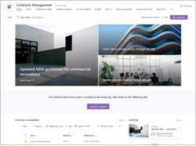
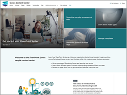

# Site templates for Microsoft Syntex

These SharePoint site templates for Microsoft Syntex are prebuilt, ready-to-deploy, and customizable. You can use these templates to create a professional site to manage, process, and track the status of business documents in your organization.

|Site template  |Description  |Site capabilites  |
|---------|---------|---------|
| **Accounts payable**    | **Accounts payable** 
Manage, process, and track purchase orders, invoices, and related files.  Find in the SharePoint site template library   Provision from the SharePoint look book service       |
- Use Microsoft Syntex to organize and classify files. 
- Extract key information from invoices using a prebuilt invoice model. 
- Share important information, such as updates to agreements or new policies. 
- Store purchase orders and invoices in preconfigured document libraries. 
- Generate files efficiently using modern templates.         |
|  **Contracts management**    |**Contracts management**   Find in the SharePoint site template library   Provision from the SharePoint look book service
Manage, process, and track contracts.         |
- Use Microsoft Syntex to organize and classify files. 
- Use prebuilt document libraries as your contract repositories. 
- Generate files efficiently using modern templates. 
- Provide templates for each contract type.
- Add other workflows to streamline your processes.         |
|  **Content center**   Provision from the SharePoint look book service  |**Content center**          |
- Learn about Syntex and find training to help you get started.  
- Learn about the different types of models. 
- Take an interactive tour to create a model. 
- Learn how to streamline everyday processes and tasks. 
- Use compliance features to reduce risks and ensure your data is secure.
        |

