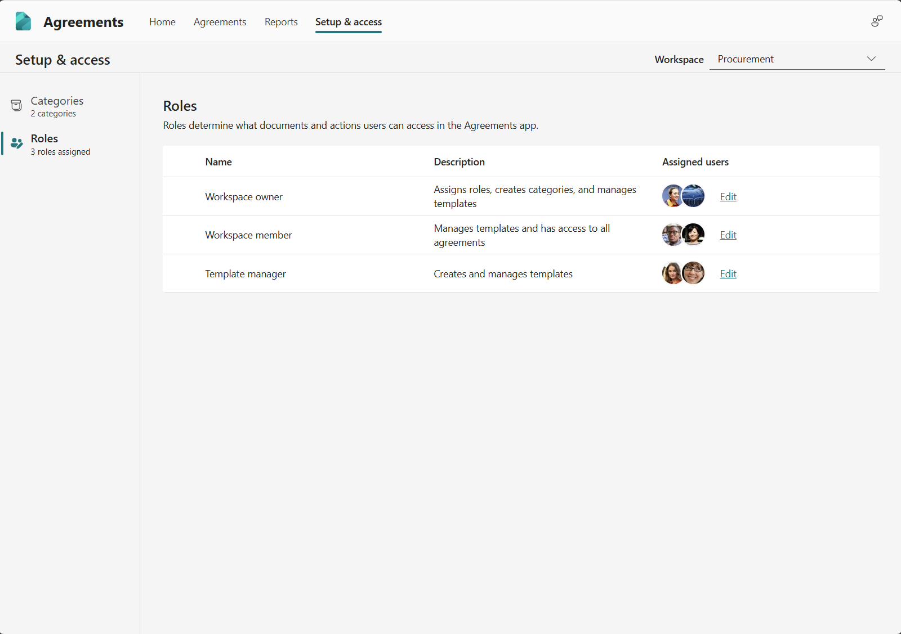

# Key concepts in SharePoint Agreements AI

SharePoint Agreements AI is an end-to-end solution that gives you the flexibility to easily manage agreements across your organization. Workspaces, Categories, Templates, and Sections are four essential concepts that can help you organize and manage your agreements.

**Workspaces** allow you to organize and manage agreements across your organization. When you create a workspace, a SharePoint site is created and is assigned to the workspace. You can create a workspace for business processes or departments in your organization that manages agreements. For example, you can have one workspace for your procurement team, and another one for your human resources team. Agreements, templates, and other files exist within the workspace and are stored in the corresponding SharePoint site. Roles are assigned to users at a workspace level, and permissions can be managed at a workspace level.

**Categories** are used to group agreements with similar intent within a workspace. For example, a procurement department workspace might have categories such as purchase agreements and sales agreements, while a human resources workspace might have categories for full-time employment agreements, part-time employment agreements, and so on. Categories help organize agreements efficiently, ensuring that related agreements are easily accessible and manageable within the appropriate context of a workspace.

**Templates** serve as a predefined structure that standardizes the creation of documents and agreements. It ensures consistency and uniformity across various documents within the workspace, streamlining the creation process and reducing the likelihood of errors. Templates can include specific sections, formatting, and content guidelines that align with the organization's requirements and branding.

**Sections** are reusable blocks of content that ensure the use of consistent language across your agreements. You can define a section and use it across multiple templates. For example, you might have a section for privacy clause or payment terms for your purchase agreements, and you can have a section for a relocation package for your full-time employee templates.

## Roles

Roles are assigned at a workspace level. Currently, SharePoint Agreements AI supports the following roles:

| Role | Description | Permissions  | Recommendation   |
| --- | --- | --- | --- |
| Workspace owner | These users own the workspace. They're responsible for managing categories, templates and roles, and have access to all agreements created within their workspace. | Role management, category management, read/write to all agreements, templates and sections. | Assign this role to users who will manage the workspace |
| Workspace member | These users are part of the workspace. They can manage sections and templates and have access to all agreements within their workspace. They can't manage categories nor roles. | Read/write to all agreements, templates and sections. | Assign this role to users who will create and manage templates and sections. |
| Template manager | These users can manage templates but won't have access to all agreements within the workspace. | Read all sections, read/write to all templates. Access to only agreements they create or are shared with them | Assign this role to those users who can help manage your templates, when you do not want them to have access to all agreements in your workspace. |

### Manage roles

Workspace owners can manage the above roles in their workspace through the Agreements app in Microsoft Teams. In the Agreements app, go to the **Setup & access** tab, and then navigate to the Roles page. Here, you can see and manage the list of users assigned to the previously mentioned roles.

> [!NOTE]
> To give other users access to generate agreements from published templates, share the template with at least read-only privileges with the users. They can create agreements from published templates shared with them and will only have access to agreements in the workspace that they create or are shared with them.

 

> [!div class="nextstepaction"]
> [See the complete list of help documentation.](agreements-overview.md#help-documentation)
