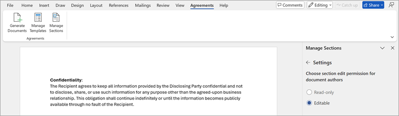
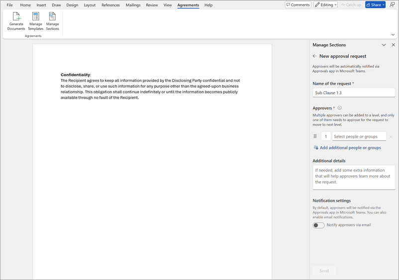

# Manage sections in the SharePoint Agreements AI solution

Sections are reusable blocks of content that can be inserted in a template. They can form one of the core building blocks of your templates. You can create sections once and use them across multiple templates.

Sections could be any standardized content section such as clauses (for example, payment terms or confidentiality clause) or phrases that are written in organization approved language. Sections are saved as Microsoft Word documents in the section library on your Agreements site.

## Create a new section

To create a section in Microsoft Word, follow these steps:

1. Go to the **Agreements** tab in Word, and select **Manage sections**.

    

2. To create a section from blank Word document, select **Create a section** from the right panel.

3. To create a section from an existing Word document, open the document, and then **Convert this document to a section** from the right panel.

    

4. Provide the following details to create a section and save it in the section library.

    

    - **Name** – Enter a name for the section.
    - **Description** – Enter a description of the section.
    - **Workspace** – Choose the workspace where to save the section. This section, once published, -s only available to be inserted in templates for this workspace. You can't change the Workspace after creating the section.
    - **Category** – Choose a category from the list of categories that are configured for the selected workspace.
    - **Language** – Choose the language in which the section will be or is written.
    - **Countries or regions** – Select the country or region where the section is applicable.
    - **Tags** – Enter keywords to better identify or search sections.

These field values help in filtering and searching the sections faster during template configuration or section management.

1. Select **Save** to create and save the section in the Draft state. A separate copy of the document is created and saved in the section library. The original file is unaffected.

2. After you save the section, the newly created section is opened in a new Word window and the section management panel opens up on the right-hand side of the Word canvas.

    

3. You can edit **Description**, **Category**, **Language**, **Countries or regions**, or **Tags** values from the **Edit details** option after you create the section.

> [!NOTE]
> You cannot change the workspace after the section is created.

## Insert fields

To insert fields in a section, follow these steps:

1. On the **Manage sections** panel, select **Add fields**.

2. In the **Set up fields** panel, enter the name of the field in the search box.

    To understand how to create a new field that isn't present in the list, see [Set up fields](agreements-create-template.md#set-up-fields).

    - 

3. After you add the field, either highlight the text in the document that you want to link to the field, or position the cursor at the exact spot in the template where you want the field to be inserted.

4. To insert the field only at the specified selection, select **Insert**. To insert the field at all similar places in the document, use the down arrow icon next to the **Insert** button, and then select **Insert at all similar places**. This inserts the field at all locations with text that exactly matches the selected text.

    

5. To identify or review the multiple field insertions in the template, use the left and right arrows at the bottom of the field card.

    

6. To delete the field or to view more details and perform additional actions, select **More options** (***...***) on the field card.

## Edit an existing section

If you need to update the content of a published section due to changes in organizational standards, policy updates, or other business needs, you can do so by editing the published section. You can also resume editing a draft section by choosing the Edit section option.

To edit a section, follow these steps:

1. Go to the **Agreements** tab in Word, and select **Manage sections**.

2. Select **Edit a section**.

3. If a draft section is selected, you can change the content and configure settings, and then choose to publish the section.

4. If a published section is selected, and you choose to edit the section, and then a new draft version of the same section is created. The published version is still available to use by template authors during template configuration.

5. When you have made all the changes to the draft version, you can choose to [republish the section](agreements-manage-sections.md#publish-a-section), which replaces the current published version of the section with the latest one.

> [!NOTE]
> Once the draft section is republished, an email notification is sent to all template creators who have used the previous published version of the section. This is to inform them of the latest published version so that they can choose to pull in the latest changes in their template. Documents already generated from those templates will have no effect on the update.

## Configure section settings

Sections have configurable settings that allow the section creator to add control to what agreements authors can do when creating an agreement from a template containing the section. 

To configure the settings, follow these steps:

1. Go to the **Agreements** tab in Word, select **Manage sections**.

2. Edit the section to configure or [create a new section](agreements-manage-sections.md#create-a-new-section).

3. Select **Settings** to set edit permissions and other behaviour of the section for document generation.

- Choose section edit permissions for document authors
   - **Editable** (default selection) – Document authors can edit the section content during document generation flow.
   - **Read-only** – Document authors can't modify the content of the section. It's locked for further edits.

   

> [!NOTE]
> These settings don't apply when a section gets inserted into a template. Template authors can modify or format content of any inserted section. The changes will stay only in the scope of the template and will not get updated in the published section.

## Request approval before publishing the section

Once you have made the relevant changes to section and configured section settings, you can optionally choose to send a draft section for approval before publishing the section.

The Agreements AI solution uses the Approvals app in Microsoft Teams to send approval requests. For more information, see [Approvals in Microsoft Teams](/power-automate/teams/native-approvals-in-teams).

Once the section state is Published, it becomes available for template creators to insert it during [template configuration flow](agreements-create-template.md#insert-a-section).

To request approval before publishing the section, follow these steps:

1. Go to the **Agreements** tab in Word, and select **Manage sections**.

2. Select the section to send for approval or [create a new section](agreements-manage-sections.md#create-a-new-section).

3. Select **Request approval before publishing** to set up an approval flow before publishing the section.

4. Create the approval request.

   

5. Fill in the name of the request, the approvers (who needs to approve it), the approval order, any additional information, and choose **Notify via email** if you want to send email notifications along with Teams notification.

6. After you configure the approval request, select **Send**.** The section document is marked as read-only once the approval request starts. Approvers who don't have access to the section will be granted view permissions.

    

7. Once the approval request is sent, you can track the request status (Approval in progress, Approval completed) through the Word pane by reloading the section management pane or selecting **Refresh**. Optionally, you can also track the request by selecting the **Sent** tab in the Approvals app in Microsoft Teams.

    

8. If you need to make changes in the section after it has been sent for approval, you can cancel the sent approval request. To do so, select **Cancel request** or select **Edit section**, which will cancel the current approval request and unlock the section for further edits. The section returns to Draft state.

    

## Publish a section

Once you have added all the relevant fields and made the necessary configurations, you can publish the section to make it available for other users.

Select **Publish** to publish the section to be used by other users in the organization to configure templates. Only published sections can be inserted in templates.

 

> [!div class="nextstepaction"]
> [See the complete list of help documentation.](agreements-overview.md#help-documentation)
