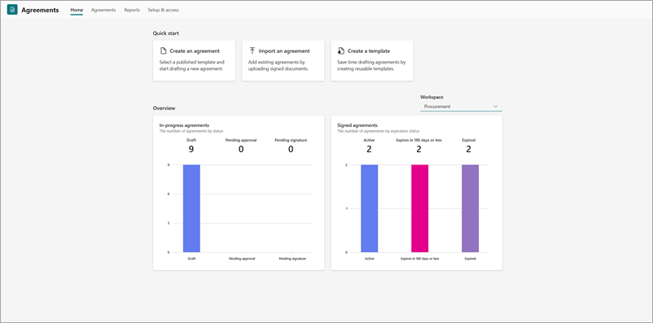

# Introduction to SharePoint Agreements AI

> [!NOTE]
> SharePoint Agreements AI is available for selective General Availability (GA). The selective GA is by invitation only. Contact your Microsoft representative or submit your nomination for the selective GA here: [Sign up for selective GA](https://aka.ms/AgreementsSelectiveGA). For a list of articles to help you set up and use this feature, see [Help documentation](#help-documentation).

## Overview

SharePoint Agreements AI is an end-to-end solution, powered by AI, to help streamline and simplify your agreements, such as nondisclosure agreements and statements of work. From drafting to execution, the solution is ready to integrate seamlessly into your flow of work.

Centralize your agreements in the new Agreements app in Microsoft Teams, draft agreements with native Microsoft Word capabilities, and gain valuable AI-driven insights, making management of your agreements more efficient.

## What you get

With SharePoint Agreements AI, you get:

- **Agreements app in Microsoft Teams**. This app serves as the central hub for managing your agreements. You can create new templates, generate agreements from these templates, and upload signed agreements. Additionally, you can gain valuable insights on agreements.

- **Agreements tab in Microsoft Word**. With the new capabilities in Microsoft Word, you can author templates and generate agreements. You can add fields and sections to your templates and incorporate approval workflows, ensuring that generated agreements are automatically routed for approval. Users can then generate new agreements from published templates easily by just filling in the required fields.

- **AI capabilities**. Manage the entire lifecycle of your agreements with value adding features powered by AI. Review agreements faster with AI-based section revision insights that describe how an agreement deviates from the original section. When you upload signed agreements, AI helps identify key properties such as the second party’s name and expiration date, helping organize your agreements and making them easily searchable.

## What you can do

With SharePoint Agreements AI, you can:

- **Centrally manage** your agreements in one place using familiar tools.
  
- **Optimize operations** and simplify your agreement management process with templates, sections, and workflow.
  
- **Get AI-powered insights** and streamline your agreements from draft to eSignature.  

## Help documentation

|Article  |Description  |
|---------|---------|
|[Licensing requirements](agreements-license-requirements.md)    |Learn how to get and assign licenses for SharePoint Agreements AI.         |
|[User prerequisites](agreements-user-prereqs.md)    |Learn what users need to fully use all of the solution features.         |
|[Set up the solution](agreements-setup.md)    |Learn how to set up and manage workspaces, add the Agreements app in Microsoft Teams, and more.         |
|[Create a template](agreements-create-template.md)    |Learn how to create and publish templates, set up fields and sections, configure workflows, and more.         |
|[Update a template](agreements-update-template.md)    |Learn how to find and edit existing templates, and publish updates to a template.         |
|[Manage sections in a template](agreements-manage-sections.md)    |Learn how to publish a new section, insert a section into a template, edit a section, and configure section settings.         |
|[Create an agreement](agreements-create-agreement.md)    |Learn how to create an agreement from a template in Microsoft Teams and in Microsoft Word.         |
|[Analyze section revisions](agreements-analyze-sections.md)    |Learn how to use the **Analyze section revisions** feature to detect changes in embedded sections, summarize the changes, and offer suggestions.       |
|[View reports](agreements-reports.md)    |Learn about the reports that are available to monitor all agreements, their statuses, and other essential metrics.         |
|[Receive approval notifications](agreements-notifications.md)    |Learn about approval notifications in the Approvals app and in email.         |
|[Import an agreement](agreements-import-agreement.md)    |Learn how to add existing agreements by uploading signed documents.        |
