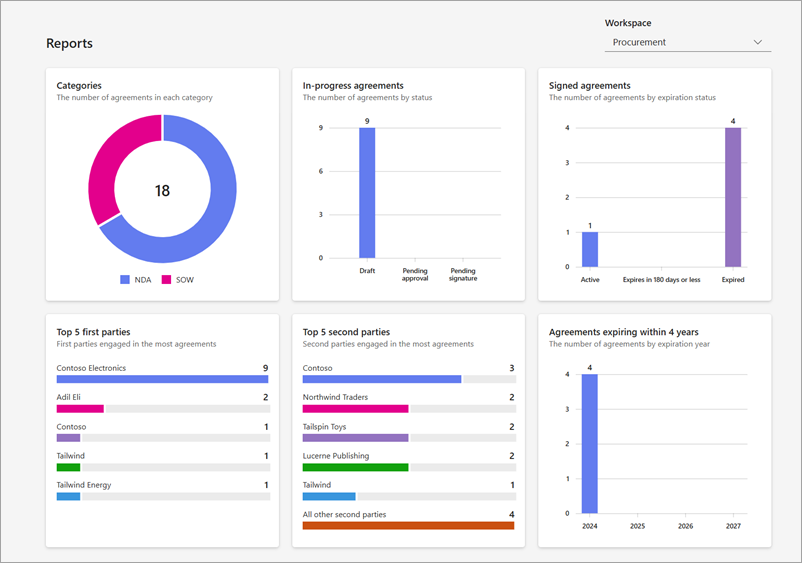

# View reports in the SharePoint Agreements AI solution

The **Report** tab in the Agreements app provides a comprehensive overview of all agreements, their statuses, and other essential metrics.

   

There are six reports available in the Agreements app. They are:

- **Categories** – Split of agreements by category showing the number of agreements in every category.

- **In-progress agreements** – Split of agreements that are in progress across draft and approval stages.

- **Signed agreements** – Split of agreements that are active, about to expire soon, or expired.

- **Top 5 first parties** – List of top five first parties by number of agreements.

- **Top 5 second parties** – List of top five second parties by number of agreements.

- **Agreements expiring within 4 years** – Split of agreements that will expire within four years.

 

> [!div class="nextstepaction"]
> [See the complete list of help documentation.](agreements-overview.md#help-documentation)