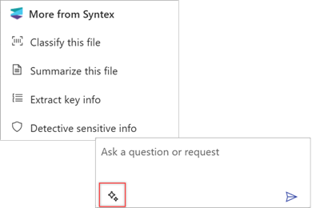

# Overview of Copilot for Microsoft Syntex (Preview)

> [!NOTE]
> The feature is currently in limited preview and subject to change.

Microsoft Syntex is now integrated with Microsoft 365 Copilot to bring the power of assistive AI into your organization's intelligent document processing.

Copilot for Syntex analyzes the text of a selected file in a SharePoint document library, in OneDrive for Business, or in Teams. It then generates a set of questions you can ask about the information in the file. The questions can be used to quickly identify the type of document, generate a summary of information in the document, and identify key points or other important information. You can also ask your own questions, such as "When does this contract expire?" or "What is the fee schedule for this project?"

## To use Copilot for Syntex

1. From a SharePoint document library, select a document.

2. On the ribbon, select **Copilot**.

    

3. The **Copilot** panel opens.

    

4. On the **Copilot** panel, you can:

    - Select one of the questions Copilot generated for you.

       

    - Enter your own question or request in the text box.

       

    - Select the starter prompt to see suggested actions tailored to the specific file.

       

5. To clear the current session, select **More** \***, and then select **Clear session**.

       

## Current limitations

- Copilot for Syntex currently works on Word (.docx), PowerPoint (.pptx), and text-readable .pdf file types. Additional file types will be added in the future.

- Copilot for Syntex is currently only available to customers in the United States, and currently only understands instructions in English. More languages and locales will be added in the future.

- Copilot for Syntex works on a single selected file at a time, and it only processes the first 4,000 tokens (approximately six pages).

- Copilot for Syntex won't process encrypted files or files stamped with "Confidential" or "Highly Confidential" sensitivity labels.

- Copilot for Syntex doesn't save the context of your session, but you can copy the information if you want to save it. 

> [!IMPORTANT] 
> It's important that you review any content the AI generates for you to make sure it has accurately produced what you wanted.

